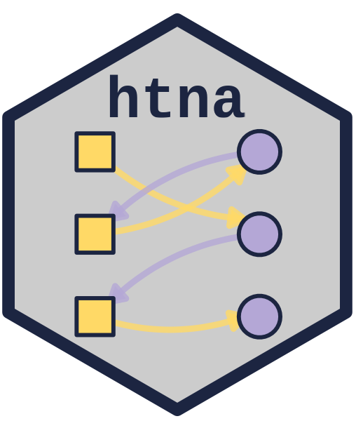
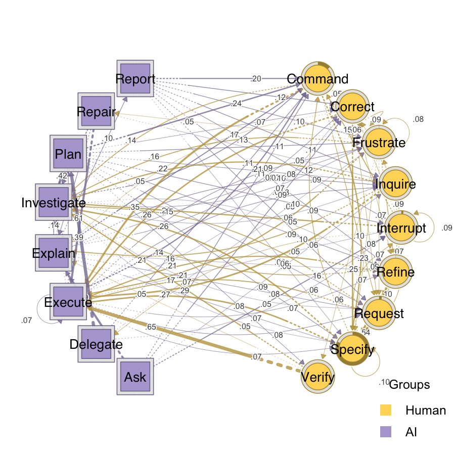

<!-- README.md is generated from README.Rmd. Please edit that file -->

# `htna`: Heterogeneous Transition Network Analysis 

<!-- badges: start -->

[](https://github.com/sonsoleslp/htna/actions/workflows/R-CMD-check.yaml)
[](https://opensource.org/licenses/MIT)
<!-- badges: end -->

`htna` is an R package for Heterogeneous Transition Network Analysis
(HTNA) that models processes or interactions between a mix two or more
actor groups (e.g.  Human and AI) as a single network. HTNA builds on
the traditions of Transition Network Analysis (TNA) and Co-occurrence
Network Analysis (CNA) and maintains the rigor of either method.

The package provides a focused API on top of the
[Nestimate](https://CRAN.R-project.org/package=Nestimate) estimation
engine and the [cograph](https://CRAN.R-project.org/package=cograph)
rendering engine: build a network over the combined sequence while
preserving the actor partition, so downstream bootstrap, permutation,
reliability, centrality, and plotting functions treat each actor’s codes
as a distinct node group.

## Installation

You can install the development version of `htna` from
[GitHub](https://github.com/sonsoleslp/htna):

``` r
# install.packages("devtools")
devtools::install_github("sonsoleslp/htna")
```

## Example

``` r
library("htna")
```

Load the example data shipped with `Nestimate`:

``` r
data(human_long, ai_long, package = "Nestimate")
```

### Build a heterogeneous transition network

`build_htna()` takes a named list of long-format data frames, one per
actor group, combines the sequences, estimates transition probabilities,
and stores the actor partition on the resulting network:

``` r
net <- build_htna(list(Human = human_long, AI = ai_long))
#> Metadata aggregated per session: ties resolved by first occurrence in 'session_date' (1 sessions), 'cluster' (42 sessions)
```

### Plot the network

`plot_htna()` auto-detects the actor groups and renders them with
distinct colours:

``` r
plot_htna(net, threshold = 0.05, layout = "circular")
#> Registered S3 methods overwritten by 'cograph':
#>   method             from     
#>   plot.net_stability Nestimate
#>   print.mcml         Nestimate
```



### Extract meta-paths

Meta-paths are type-level patterns that abstract away from concrete
states. For example, `Human->AI->Human` captures every length-3 path
that starts with a Human code, transitions to an AI code, and returns to
a Human code:

``` r
extract_meta_paths(net)
#> Meta-paths (type-level) over 429 sequences
#> Rows: 28 | Lengths: 2, 3, 4 | Gaps: 0
#>            schema length gap count n_seq support frequency lift
#>         Human->AI      2   0  5970   428   0.998     0.316 1.28
#>         AI->Human      2   0  5693   424   0.988     0.301 1.22
#>      Human->Human      2   0  4674   422   0.984     0.247 0.79
#>            AI->AI      2   0  2581   403   0.939     0.136 0.70
#>  Human->AI->Human      3   0  3593   402   0.937     0.194 1.41
#>  Human->Human->AI      3   0  3172   422   0.984     0.172 1.25
#>  AI->Human->Human      3   0  2828   403   0.939     0.153 1.11
#>     AI->Human->AI      3   0  2744   383   0.893     0.148 1.36
#>     Human->AI->AI      3   0  2189   403   0.939     0.118 1.09
#>     AI->AI->Human      3   0  2100   397   0.925     0.114 1.04
#> ... (18 more)
```

Search for a specific schema with wildcards:

``` r
extract_meta_paths(net, schema = "Human->*->Human")
#> Meta-paths (type-level) over 429 sequences
#> Rows: 2 | Lengths: 3 | Gaps: 0
#>               schema length gap count n_seq support frequency lift
#>     Human->AI->Human      3   0  3593   402   0.937     0.709 1.41
#>  Human->Human->Human      3   0  1472   396   0.923     0.291 0.46
```

## Related packages

- [`tna`](https://CRAN.R-project.org/package=tna) – Transition Network
  Analysis for homogeneous sequences.
- [`Nestimate`](https://CRAN.R-project.org/package=Nestimate) – Network
  estimation, bootstrap, permutation, reliability, and centrality.
- [`cograph`](https://CRAN.R-project.org/package=cograph) – Network
  visualisation and rendering.
- [`codyna`](https://CRAN.R-project.org/package=codyna) – Sequence
  patterns, outcomes, and indices.
