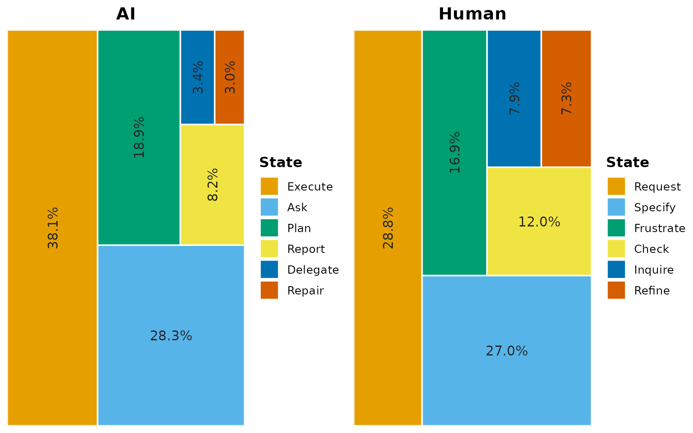
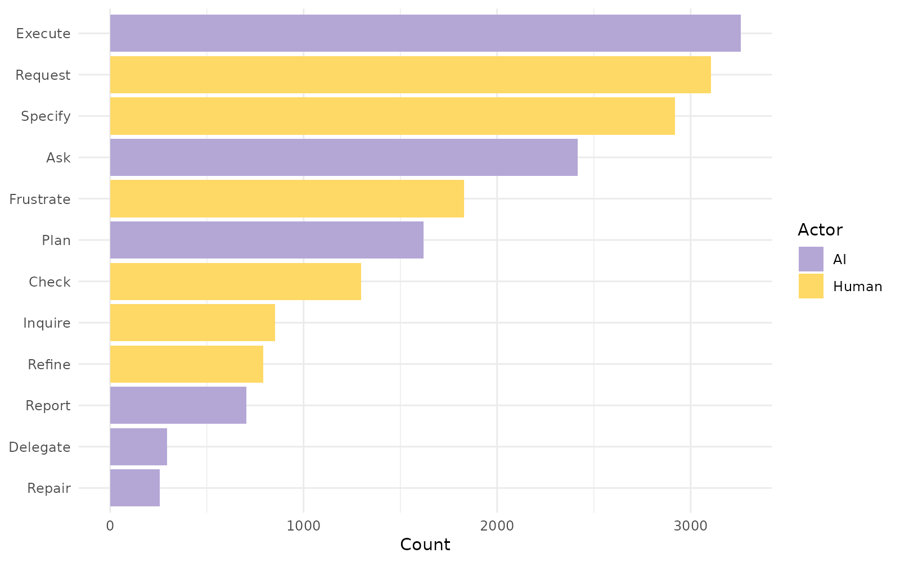
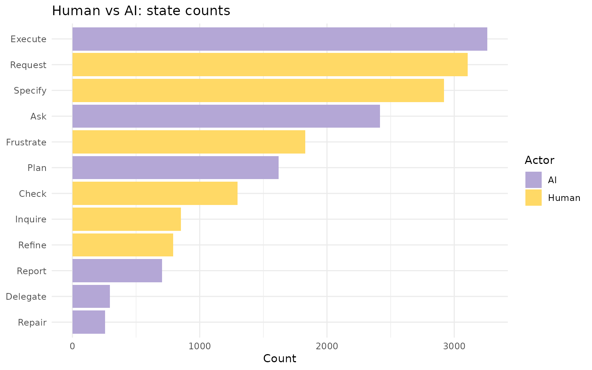
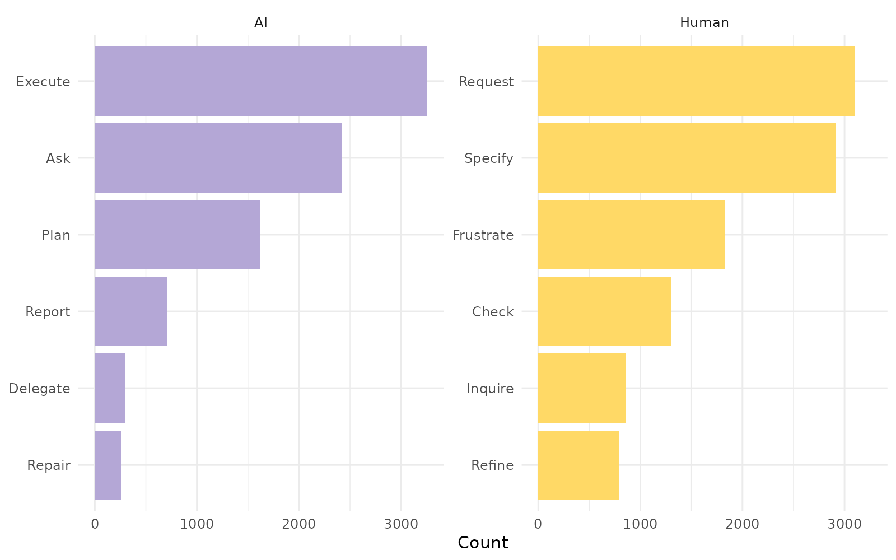
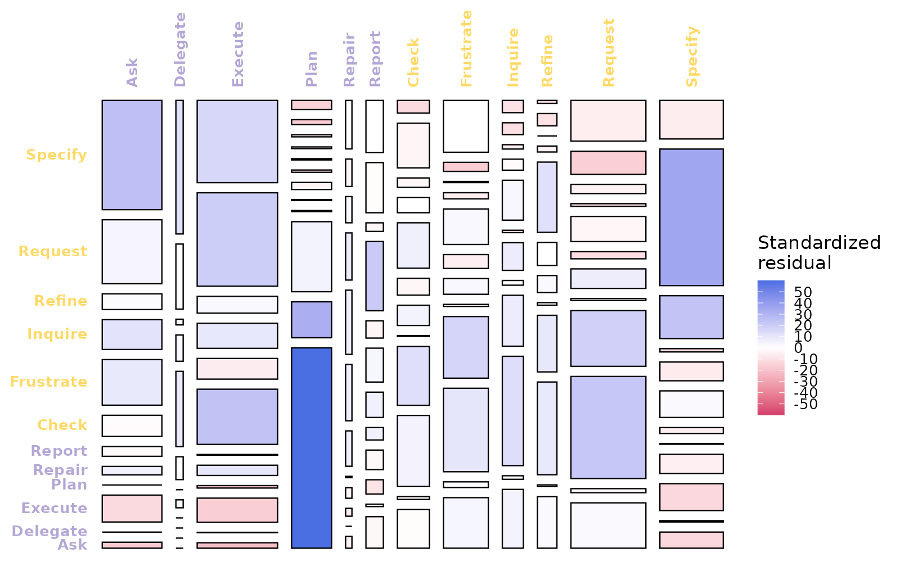
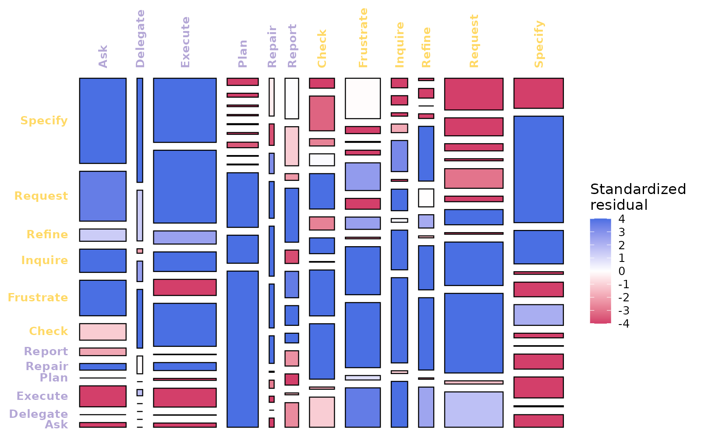
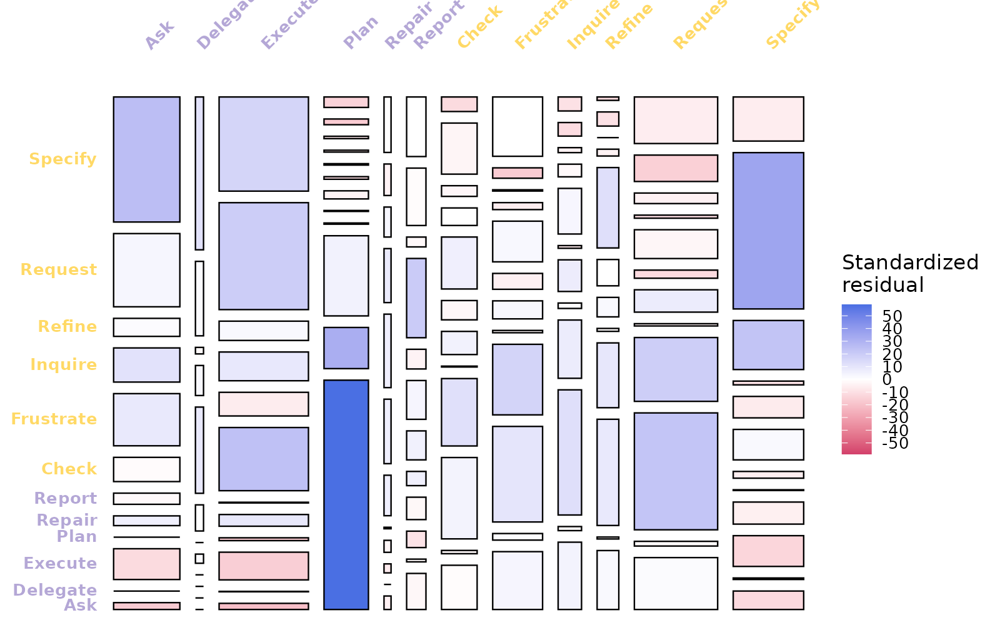

# State frequencies and chi-square mosaics

In this vignette, we look at additional summary functions and
visualizations in `htna`. We will use two networks constructed from the
bundled `human_ai` corpus (Human + AI events tagged by `actor_type`; see
[`?human_ai`](https://sonsoles.me/htna/reference/human_ai.md)). The
frequency family operates on either, but the mosaic family requires an
integer-weighted network because the chi-square test acts on counts;
this is the network produced under `method = "frequency"`.

``` r

library(htna)
data(human_ai)

net      <- build_htna(human_ai, actor_type = "actor_type")
net_freq <- build_htna(human_ai, actor_type = "actor_type",
                       method = "frequency")
```

## Marginal state distributions

### Tabular summary

[`frequencies_htna()`](https://sonsoles.me/htna/reference/frequencies_htna.md)
returns the per-actor marginal state distribution as a data frame with
one row per (`actor_type`, `state`) pair. Columns are: actor type
(`group`), state, count, and within-network proportion. The table is the
data underlying every chart in this section.

``` r

frequencies_htna(net)
#>    group     state count proportion
#> 1     AI   Execute  3258 0.38100807
#> 2  Human   Request  3104 0.28751389
#> 3  Human   Specify  2920 0.27047054
#> 4     AI       Ask  2416 0.28254005
#> 5  Human Frustrate  1829 0.16941460
#> 6     AI      Plan  1620 0.18945153
#> 7  Human     Check  1298 0.12022971
#> 8  Human   Inquire   853 0.07901074
#> 9  Human    Refine   792 0.07336050
#> 10    AI    Report   705 0.08244650
#> 11    AI  Delegate   295 0.03449889
#> 12    AI    Repair   257 0.03005496
```

### Graphical summary: `plot_frequencies_htna()`

[`plot_frequencies_htna()`](https://sonsoles.me/htna/reference/plot_frequencies_htna.md)
renders the same marginal distribution in three layouts. Each layout
encodes the same data but is optimised for a different reading task.

#### Treemap (`view = "treemap"`, default)

Each panel corresponds to one actor; tile area within a panel encodes
the within-network proportion of the corresponding state. The layout is
space-efficient and allows the full state vocabulary to be displayed
simultaneously.

``` r

plot_frequencies_htna(net)
```



#### Combined bars (`view = "bars"`)

The bars layout collapses both actor types onto a single y-axis, sorts
the states by total count, and colours the bars by actor. This layout is
appropriate when the analytic task is direct numerical comparison across
the full vocabulary.

``` r

plot_frequencies_htna(net, view = "bars")
```



The bars layout returns a ggplot object, permitting modification through
standard ggplot composition operators:

``` r

plot_frequencies_htna(net, view = "bars") +
  ggplot2::labs(title = "Human vs AI: state counts")
```



#### Per-actor faceted bars (`view = "facet"`)

The faceted layout assigns each actor its own panel with an independent
y-axis. This is appropriate when the actors differ substantially in
event volume, since a shared scale would compress the lower-volume
actor’s bars beyond legibility.

``` r

plot_frequencies_htna(net, view = "facet")
```



## Joint transition distribution: chi-square mosaic

[`mosaic_plot_htna()`](https://sonsoles.me/htna/reference/mosaic_plot_htna.md)
displays the joint distribution of `(source, target)` transitions as a
chi-square mosaic. Each cell of the transition matrix is rendered as a
rectangle whose area is proportional to the joint share of that
transition; cell colour encodes the standardised residual against an
independence model. Cells with positive residuals (over-represented
relative to independence) are coloured blue; cells with negative
residuals (under-represented) are coloured red; cells whose observed
value matches the independence prediction are white.

The chi-square test requires integer counts, hence the requirement for a
frequency-method network.

### Default residuals (permutation-based)

The default residual estimator is permutation-based, with `n_perm = 500`
iterations. Permutation residuals are appropriate when cell counts are
sparse or when the chi-square asymptotic approximation is not trusted;
the trade-off is computation time.

``` r

mosaic_plot_htna(net_freq, seed = 1L)
```


Cells with strong positive residuals identify transitions that
characterise the process beyond what would be expected by chance; cells
with strong negative residuals identify transitions that are
systematically suppressed.

### Asymptotic residuals (`residuals = "asymptotic"`)

The closed-form chi-square standardised residual estimator
(`chisq.test()$stdres`) is faster and is the convention used by `tna`
and `vcd`. It is appropriate when cell counts are large enough for the
asymptotic approximation to hold.

``` r

mosaic_plot_htna(net_freq, residuals = "asymptotic")
```



For htna corpora of typical size (hundreds of sessions, hundreds to
thousands of transitions per cell), permutation and asymptotic residuals
agree closely.

### Colour-scale clipping (`range = c(-4, 4)`)

By default the colour scale is calibrated to the maximum absolute
residual in the matrix. A single extreme cell can therefore desaturate
the remainder of the chart. Clipping the range to a fixed interval
preserves contrast across the matrix and supports comparison of mosaics
across networks.

``` r

mosaic_plot_htna(net_freq, range = c(-4, 4), seed = 1L)
```



A range of ±4 is conventional in mosaic displays; residuals beyond the
range saturate to the most intense colour.

### Axis-label rotation (`top_angle`, `left_angle`)

For matrices with long state names or large vocabularies, axis labels
may collide. The `top_angle` and `left_angle` arguments rotate the
labels for legibility.

``` r

mosaic_plot_htna(net_freq, top_angle = 45, left_angle = 0, seed = 1L)
```


