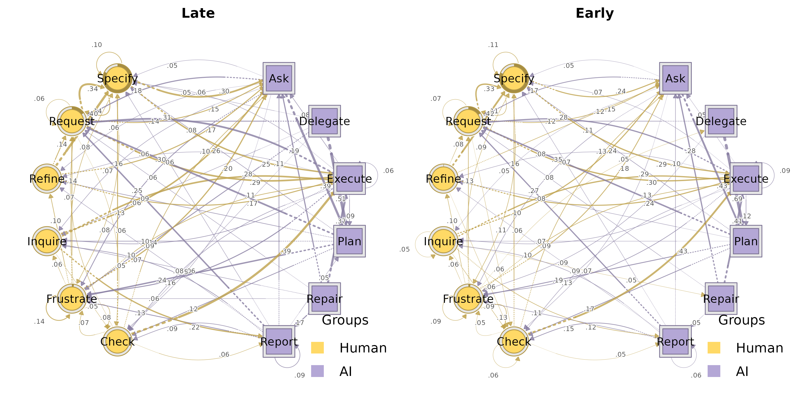
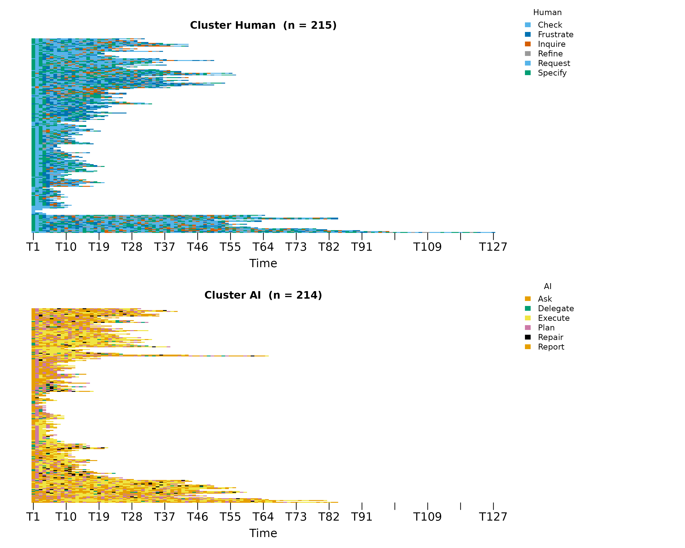
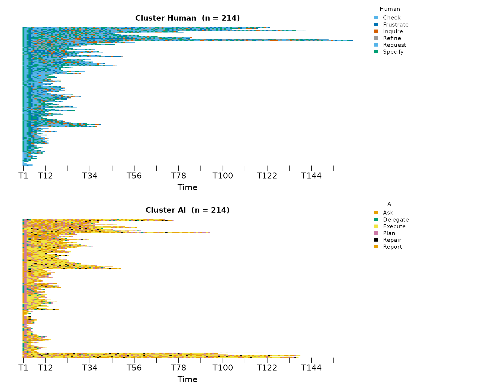
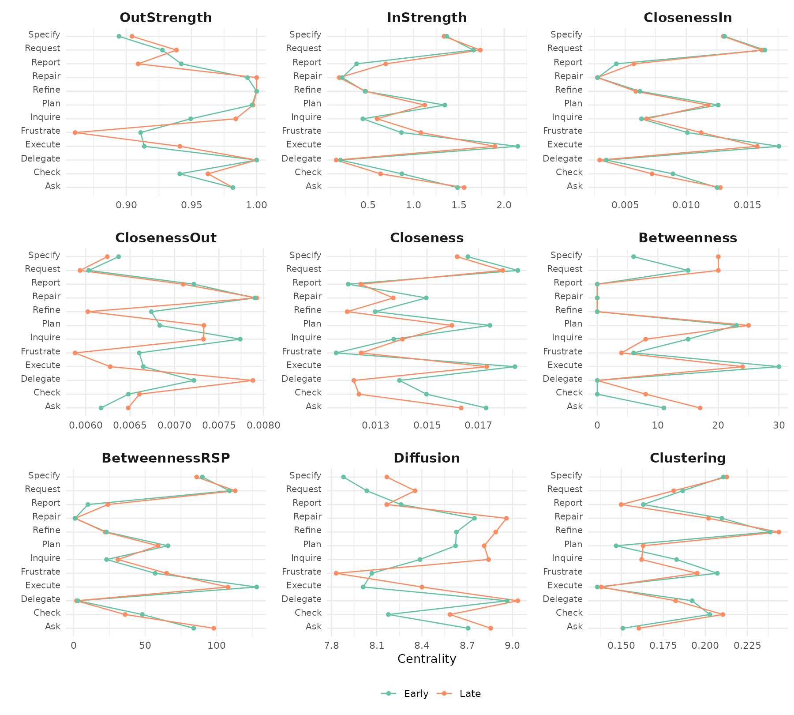
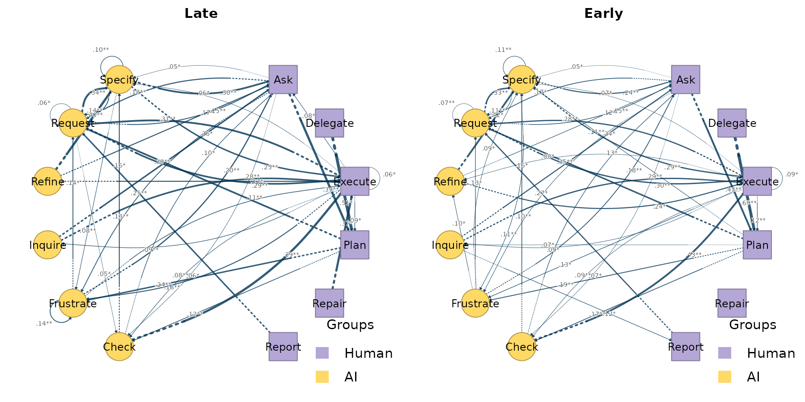
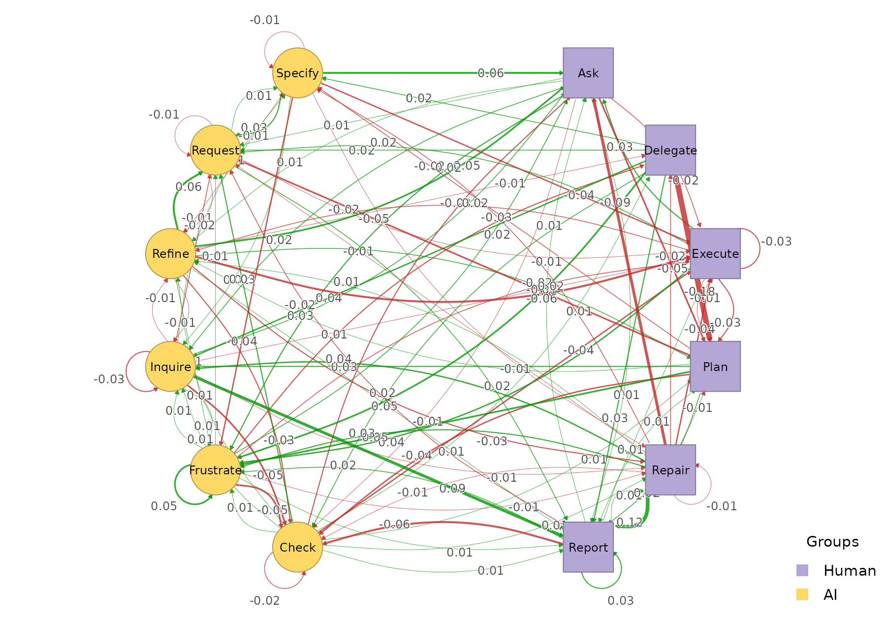
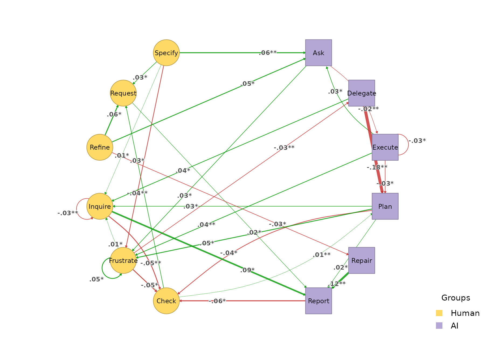
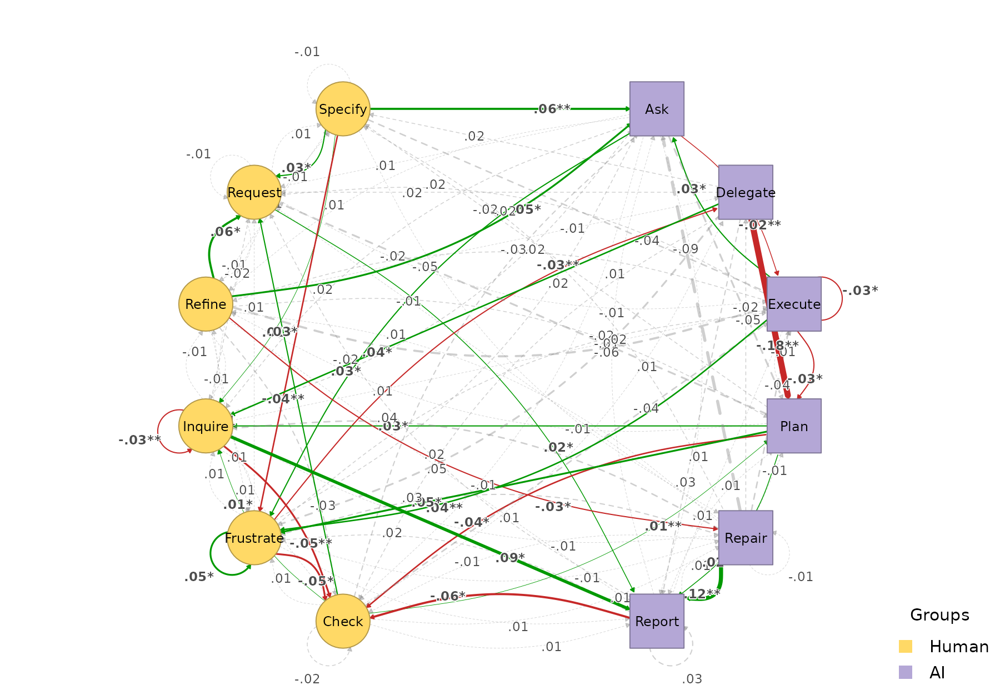

# Grouped HTNA

A common HTNA question is whether the same actor partition behaves
*differently* across cohorts – e.g. early-phase versus late-phase
sessions of an interaction corpus; control vs. experimental groups;
female vs. male, etc..
[`build_htna()`](https://sonsoles.me/htna/reference/build_htna.md)
supports this directly by passing the session-level grouping column to
the function. The result is **one network per cohort**, each preserving
the actor partition. Every other function in `htna` recognises the
grouped result and iterates over cohorts.

## An early / late example

We use the bundled `human_ai` corpus (Human + AI codes from
[`Nestimate::human_long`](https://saqr.me/Nestimate/reference/long-data.html)
/ `ai_long`, with a slightly simplified alphabet – see
[`?human_ai`](https://sonsoles.me/htna/reference/human_ai.md)). Sessions
are split chronologically: ordered by their first `session_date` (with
`session_id` as a deterministic tiebreak), the first half of the
sessions form the *Early* cohort and the rest form the *Late* cohort.

``` r

library(htna)
data(human_ai)

# Order sessions chronologically by their first `session_date`, with
# `session_id` as a deterministic tiebreak for sessions that started
# the same day. First half = Early, rest = Late.
sess_start <- aggregate(session_date ~ session_id, data = human_ai, FUN = min)
sess_start <- sess_start[order(sess_start$session_date,
                               sess_start$session_id), ]
half       <- nrow(sess_start) %/% 2L
early_sess <- sess_start$session_id[seq_len(half)]

human_ai$phase <- ifelse(human_ai$session_id %in% early_sess,
                         "Early", "Late")
human_ai$phase <- factor(human_ai$phase, levels = c("Early", "Late"))
table(human_ai$phase)
#> 
#> Early  Late 
#> 10170  9177
```

## Building one network per cohort

[`build_htna()`](https://sonsoles.me/htna/reference/build_htna.md) takes
the long data frame, the actor-type column, and a `group` argument
naming the session-level cohort column:

``` r

grp <- build_htna(
  human_ai,
  actor_type = "actor_type",
  group      = "phase"
)
length(grp)
#> [1] 2
names(grp)
#> [1] "Late"  "Early"
```

The result is a named list of HTNA networks. Indexing one element gives
a regular HTNA network you can use exactly like any other:

``` r

grp$Early
#> Transition Network (relative probabilities) [directed]
#>   Weights: [0.001, 0.689]  |  mean: 0.089
#> 
#>   Weight matrix:
#>               Ask Check Delegate Execute Frustrate Inquire  Plan Refine Repair
#>   Ask       0.018 0.069    0.000   0.033     0.099   0.054 0.433  0.044  0.005
#>   Check     0.128 0.059    0.013   0.430     0.052   0.001 0.003  0.039  0.028
#>   Delegate  0.000 0.031    0.000   0.012     0.087   0.012 0.689  0.012  0.000
#>   Execute   0.050 0.089    0.000   0.086     0.127   0.090 0.119  0.078  0.003
#>   Frustrate 0.184 0.129    0.054   0.126     0.089   0.056 0.002  0.096  0.032
#>   Inquire   0.239 0.094    0.027   0.289     0.036   0.051 0.010  0.024  0.046
#>   Plan      0.000 0.165    0.000   0.018     0.193   0.068 0.004  0.079  0.006
#>   Refine    0.118 0.059    0.009   0.236     0.005   0.017 0.005  0.000  0.038
#>   Repair    0.282 0.014    0.035   0.408     0.028   0.028 0.021  0.021  0.007
#>   Report    0.097 0.148    0.000   0.011     0.112   0.101 0.043  0.058  0.036
#>   Request   0.147 0.057    0.019   0.295     0.015   0.009 0.007  0.013  0.007
#>   Specify   0.242 0.018    0.040   0.291     0.114   0.006 0.014  0.001  0.016
#>             Report Request Specify
#>   Ask        0.023   0.166   0.054
#>   Check      0.052   0.038   0.156
#>   Delegate   0.006   0.124   0.025
#>   Execute    0.007   0.283   0.067
#>   Frustrate  0.014   0.131   0.087
#>   Inquire    0.123   0.039   0.024
#>   Plan       0.016   0.346   0.105
#>   Refine     0.019   0.075   0.420
#>   Repair     0.049   0.077   0.028
#>   Report     0.058   0.267   0.069
#>   Request    0.026   0.072   0.332
#>   Specify    0.039   0.114   0.106 
#> 
#>   Initial probabilities:
#>   Specify       0.813  ████████████████████████████████████████
#>   Request       0.159  ████████
#>   Frustrate     0.023  █
#>   Refine        0.005  
#>   Ask           0.000  
#>   Check         0.000  
#>   Delegate      0.000  
#>   Execute       0.000  
#>   Inquire       0.000  
#>   Plan          0.000  
#>   Repair        0.000  
#>   Report        0.000
grp$Late
#> Transition Network (relative probabilities) [directed]
#>   Weights: [0.001, 0.508]  |  mean: 0.090
#> 
#>   Weight matrix:
#>               Ask Check Delegate Execute Frustrate Inquire  Plan Refine Repair
#>   Ask       0.018 0.058    0.000   0.012     0.132   0.072 0.385  0.058  0.002
#>   Check     0.101 0.037    0.019   0.385     0.065   0.009 0.017  0.045  0.041
#>   Delegate  0.000 0.049    0.000   0.008     0.139   0.057 0.508  0.016  0.000
#>   Execute   0.076 0.085    0.000   0.059     0.165   0.085 0.091  0.057  0.001
#>   Frustrate 0.204 0.078    0.024   0.110     0.139   0.064 0.005  0.100  0.026
#>   Inquire   0.263 0.046    0.027   0.281     0.041   0.016 0.009  0.009  0.039
#>   Plan      0.000 0.124    0.000   0.013     0.241   0.101 0.003  0.094  0.004
#>   Refine    0.171 0.030    0.003   0.171     0.011   0.011 0.022  0.000  0.011
#>   Repair    0.189 0.009    0.018   0.369     0.063   0.072 0.009  0.027  0.000
#>   Report    0.106 0.091    0.000   0.007     0.133   0.103 0.054  0.059  0.042
#>   Request   0.149 0.054    0.018   0.288     0.017   0.010 0.009  0.005  0.007
#>   Specify   0.300 0.015    0.040   0.253     0.076   0.016 0.016  0.004  0.009
#>             Report Request Specify
#>   Ask        0.032   0.180   0.050
#>   Check      0.058   0.065   0.157
#>   Delegate   0.033   0.139   0.049
#>   Execute    0.013   0.305   0.063
#>   Frustrate  0.029   0.138   0.083
#>   Inquire    0.215   0.018   0.034
#>   Plan       0.039   0.299   0.083
#>   Refine     0.027   0.139   0.405
#>   Repair     0.171   0.063   0.009
#>   Report     0.091   0.251   0.064
#>   Request    0.042   0.062   0.340
#>   Specify    0.036   0.139   0.096 
#> 
#>   Initial probabilities:
#>   Specify       0.823  ████████████████████████████████████████
#>   Request       0.153  ███████
#>   Frustrate     0.023  █
#>   Ask           0.000  
#>   Check         0.000  
#>   Delegate      0.000  
#>   Execute       0.000  
#>   Inquire       0.000  
#>   Plan          0.000  
#>   Refine        0.000  
#>   Repair        0.000  
#>   Report        0.000
```

Because both cohorts were built from the same alphabet, both networks
have the **same nodes** – which is exactly what
[`plot_htna_diff()`](https://sonsoles.me/htna/reference/plot_htna_diff.md)
and
[`permutation_htna()`](https://sonsoles.me/htna/reference/permutation_htna.md)
need.

## Plotting per cohort

[`plot_htna()`](https://sonsoles.me/htna/reference/plot_htna.md)
iterates over cohorts and draws one network per element. It does not
manage the layout grid – wrap with `par(mfrow = ...)` if you want a
panel:

``` r

op <- par(mfrow = c(1, 2))
plot_htna(grp)
```



``` r

par(op)
```

## Per-actor sequences per cohort

[`sequence_plot_htna()`](https://sonsoles.me/htna/reference/sequence_plot_htna.md)
works the same way:

``` r

sequence_plot_htna(grp,   type = "index")
```



## Centralities per cohort

`centralities_htna(grp)` returns one tidy data frame, with a leading
`group` column identifying the cohort:

``` r

ct <- centralities_htna(grp)
head(ct, 10)
#>    group      node actor OutStrength InStrength ClosenessIn ClosenessOut
#> 1   Late       Ask    AI   0.9818031  1.5589461 0.012787860  0.006478909
#> 2   Late     Check Human   0.9626168  0.6386122 0.007197319  0.006605395
#> 3   Late  Delegate    AI   1.0000000  0.1490735 0.002917657  0.007882479
#> 4   Late   Execute    AI   0.9411332  1.8979808 0.015804367  0.006276049
#> 5   Late Frustrate Human   0.8607443  1.0820451 0.011215144  0.005880667
#> 6   Late   Inquire Human   0.9839817  0.6005806 0.006753107  0.007325994
#> 7   Late      Plan    AI   0.9972028  1.1252050 0.011785910  0.007330088
#> 8   Late    Refine Human   1.0000000  0.4740402 0.005877737  0.006024616
#> 9   Late    Repair    AI   1.0000000  0.1826564 0.002721100  0.007924645
#> 10  Late    Report    AI   0.9090909  0.6955351 0.005709637  0.007097699
#>     Closeness Betweenness BetweennessRSP Diffusion Clustering
#> 1  0.01632119          17             98  8.856237  0.1604590
#> 2  0.01234619           8             36  8.586347  0.2104778
#> 3  0.01214724           0              2  9.035552  0.1823412
#> 4  0.01731834          24            108  8.400011  0.1380461
#> 5  0.01243172           4             65  7.830994  0.1951504
#> 6  0.01403984           8             31  8.842141  0.1621084
#> 7  0.01596275          25             59  8.812412  0.1629786
#> 8  0.01188981           0             22  8.889109  0.2437973
#> 9  0.01368159           0              1  8.960075  0.2019068
#> 10 0.01241482           0             24  8.166331  0.1499067
```

[`plot_centralities()`](https://sonsoles.me/htna/reference/plot_centralities.md)
faces a grid: rows are cohorts, columns are measures, so cohort-level
differences are easy to read at a glance:

``` r

plot_centralities(grp, by = "group")
```



## Bootstrap per cohort

`bootstrap_htna(grp)` runs the bootstrap on each cohort and returns a
group of bootstrap results.
[`plot_htna_bootstrap()`](https://sonsoles.me/htna/reference/plot_htna_bootstrap.md)
iterates again:

``` r

boots <- bootstrap_htna(grp, iter = 200)
op <- par(mfrow = c(1, 2))
plot_htna_bootstrap(boots, display = "significant")
```



``` r

par(op)
```

## Centrality stability per cohort

`centrality_stability_htna(grp)` runs the case-dropping centrality
stability check on each cohort and returns a named list of
`htna_stability` objects. Each cohort’s `cs` reports the largest
session-drop proportion at which `InStrength`, `OutStrength`, and
`Betweenness` still correlate with the originals at the default 0.7 /
0.95 threshold:

``` r

stab <- centrality_stability_htna(grp, iter = 100, seed = 1)
sapply(stab, function(s) s$cs)
#>             Late Early
#> InStrength   0.9   0.9
#> OutStrength  0.9   0.8
#> Betweenness  0.8   0.8
```

The columns are cohorts, the rows are centrality measures. By the
Epskamp et al. (2018) convention, CS \> 0.25 is acceptable and CS \> 0.5
is preferred for inferential use; the maximum reportable value is the
upper bound of the drop-proportion grid.

## Comparing the two cohorts

Both networks share an alphabet, so you can compute the elementwise
difference directly with
[`plot_htna_diff()`](https://sonsoles.me/htna/reference/plot_htna_diff.md).
Positive (Late \> Early) is green, negative (Early \> Late) is red:

``` r

plot_htna_diff(grp$Late, grp$Early)
```



[`permutation_htna()`](https://sonsoles.me/htna/reference/permutation_htna.md)
quantifies which differences are statistically significant:

``` r

perm <- permutation_htna(grp$Late, grp$Early, iter = 500)
plot_htna_diff(perm)
```



``` r

plot_htna_diff(perm, show_nonsig = TRUE)
```



## Cohort-level pattern comparison

[`permutation_htna()`](https://sonsoles.me/htna/reference/permutation_htna.md)
tests edge-level differences between cohorts. For *pattern*-level
differences — recurring k-grams that characterise one cohort over the
other — see the [sequence comparison
vignette](https://sonsoles.me/htna/articles/sequence-comparison.md). The
same grouped network feeds directly into
[`sequence_compare_htna()`](https://sonsoles.me/htna/reference/sequence_compare_htna.md),
which also supports a `level = "type"` option that runs the comparison
on meta-paths (e.g. `Human -> AI -> Human`) rather than concrete state
codes.

## Indexing

Because the result of `build_htna(..., group = ...)` is a named list,
all standard list operations work: `grp[["Early"]]`,
`grp[c("Early", "Late")]`, `length(grp)`, `names(grp)`. Subsets keep the
grouped class so they pass straight back to the wrappers above.
