# Getting Started with htna

Heterogeneous Transition Network Analysis (HTNA) studies sequences in
which two or more actors interleave – a learner and a tutor, a human and
an AI, a clinician and a patient – and treats each actor’s codes as a
distinct node group. The `htna` package builds the network, computes the
usual analytical quantities, and renders the result with the actor
partition baked into colour, layout, and the legend.

## 1. Building a heterogeneous network

Start from one long-format data frame with an actor-type column tagging
each row (`"Human"` or `"AI"`) and pass its name as `actor_type` to
[`build_htna()`](https://sonsoles.me/htna/reference/build_htna.md). The
result is a network whose nodes carry the actor label they came from.
The bundled `human_ai` corpus (see
[`?human_ai`](https://sonsoles.me/htna/reference/human_ai.md)) is used
throughout this vignette.

``` r

library(htna)
data(human_ai)

net <- build_htna(human_ai, actor_type = "actor_type")
```

## 2. Plotting the network

[`plot_htna()`](https://sonsoles.me/htna/reference/plot_htna.md) lays
out actor groups around the circle, colours each node by its actor type,
and draws the actor legend below the plot:

``` r

plot_htna(net)
```

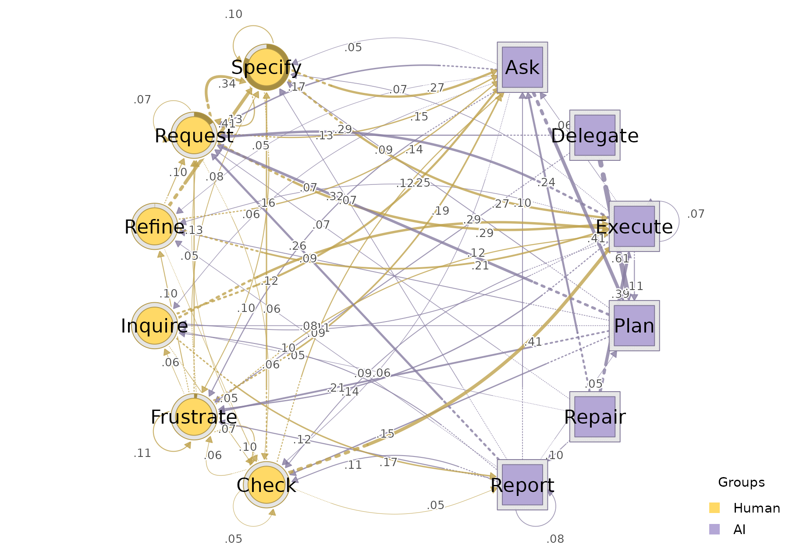

## 3. Per-actor sequence plots

[`sequence_plot_htna()`](https://sonsoles.me/htna/reference/sequence_plot_htna.md)
shows the temporal structure of the sessions. With `by = "state"` (the
default) each cell is coloured by its code; with `by = "group"` cells
are coloured by actor type. `type` selects the layout: `"index"` renders
one row per session, `"heatmap"` collapses across sessions into a single
carpet, and `"distribution"` shows the state composition per timepoint
as a stacked area.

``` r

sequence_plot_htna(net, by = "state", type = "index")
```

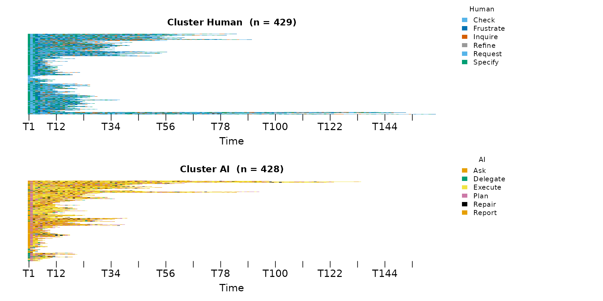

``` r

sequence_plot_htna(net, by = "state", type = "heatmap")
```

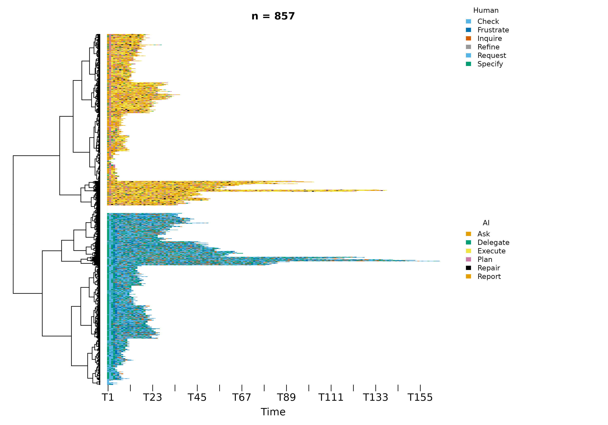

``` r

sequence_plot_htna(net, by = "group", type = "distribution", na_color = "white")
```

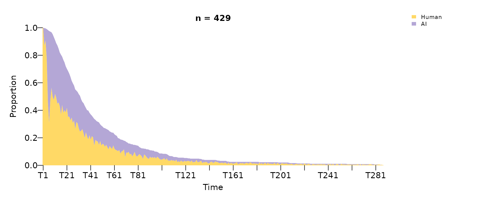

When `by = "state"`, the legend is split into one block per actor type
with the actor type name above each block, so the reader can tell at a
glance which codes belong to which actor type.

## 4. Centralities

[`centralities_htna()`](https://sonsoles.me/htna/reference/centralities_htna.md)
returns per-node centrality measures: one row per node, one column per
measure, defaulting to nine standard measures (out/in strength, in/out
closeness, closeness, betweenness, RSP betweenness, diffusion,
clustering). Pass `measures = c(...)` to restrict to a specific set.

``` r

centralities_htna(net)
#>         node actor OutStrength InStrength ClosenessIn ClosenessOut  Closeness
#> 1        Ask    AI   0.9817642  1.5266008 0.012587425  0.006192077 0.01670617
#> 2      Check Human   0.9499230  0.7522288 0.008035193  0.006492281 0.01340661
#> 3   Delegate    AI   1.0000000  0.1740318 0.003015314  0.007567519 0.01315340
#> 4    Execute    AI   0.9256198  2.0338718 0.016720393  0.006367002 0.01784416
#> 5  Frustrate Human   0.8861885  0.9672100 0.010511066  0.006322199 0.01169411
#> 6    Inquire Human   0.9671362  0.5147284 0.006592669  0.007311931 0.01399616
#> 7       Plan    AI   0.9967742  1.2496499 0.012325008  0.006926899 0.01675952
#> 8     Refine Human   1.0000000  0.4703420 0.005943026  0.006143417 0.01250189
#> 9     Repair    AI   0.9960474  0.1995057 0.002655997  0.007958047 0.01404200
#> 10    Report    AI   0.9225146  0.5246300 0.005125410  0.007099789 0.01180054
#> 11   Request Human   0.9329032  1.6926517 0.016089323  0.005980693 0.01812498
#> 12   Specify Human   0.8991424  1.3525625 0.013064153  0.006197358 0.01619607
#>    Betweenness BetweennessRSP Diffusion Clustering
#> 1           13             91  8.778380  0.1543463
#> 2            0             42  8.354335  0.2074548
#> 3            0              3  9.003808  0.1868121
#> 4           29            118  8.186741  0.1359230
#> 5            2             61  7.948727  0.2014196
#> 6           14             27  8.615216  0.1703483
#> 7           25             63  8.715568  0.1531488
#> 8            0             23  8.751161  0.2393259
#> 9            0              1  8.852837  0.2039989
#> 10           0             17  8.186046  0.1557107
#> 11          19            110  8.181829  0.1842378
#> 12          15             88  8.008017  0.2112340
```

To plot centralities, the
[`plot_centralities()`](https://sonsoles.me/htna/reference/plot_centralities.md)
function can be used. Each panel is one measure; bars are coloured per
state by default, or by actor type with `by = "group"`:

``` r

plot_centralities(net, by = "state")
```

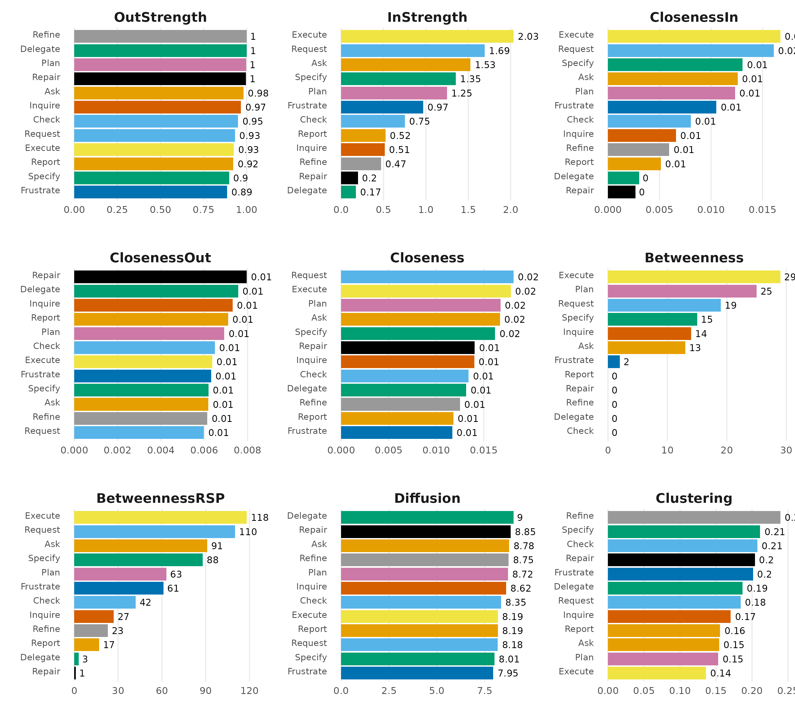

``` r

plot_centralities(net, by = "group")
```

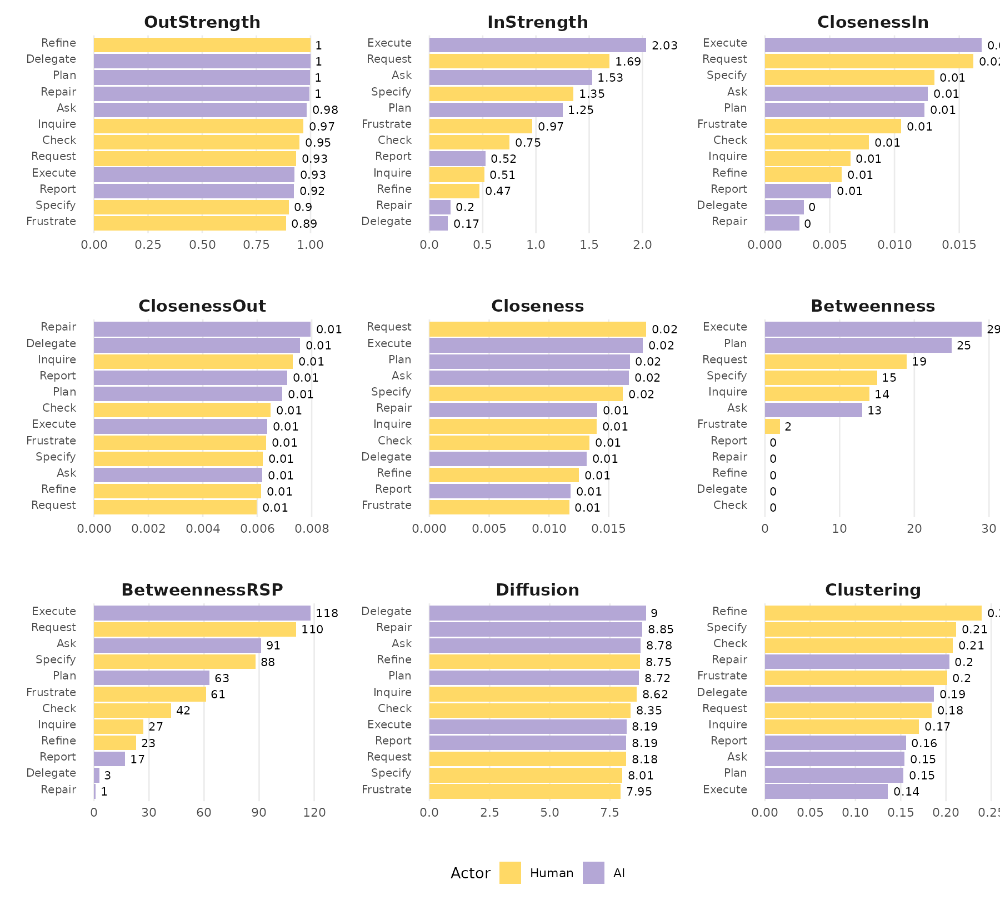

## 5. Bootstrap

To validate which transitions of an HTNA model are stable,
[`bootstrap_htna()`](https://sonsoles.me/htna/reference/bootstrap_htna.md)
resamples sessions to obtain edge-weight stability and per-edge
p-values.
[`plot_htna_bootstrap()`](https://sonsoles.me/htna/reference/plot_htna_bootstrap.md)
renders the resampled network. By default (`display = "styled"`) all
edges are shown, with non-significant edges dashed; pass
`display = "significant"` to keep only the edges that pass the
significance threshold.

``` r

boot <- bootstrap_htna(net)
plot_htna_bootstrap(boot)
```

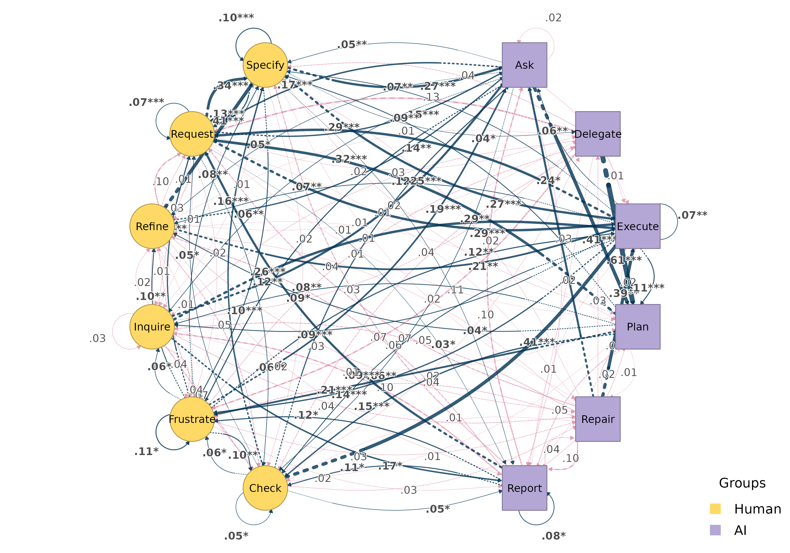

``` r

plot_htna_bootstrap(boot, display = "significant")
```

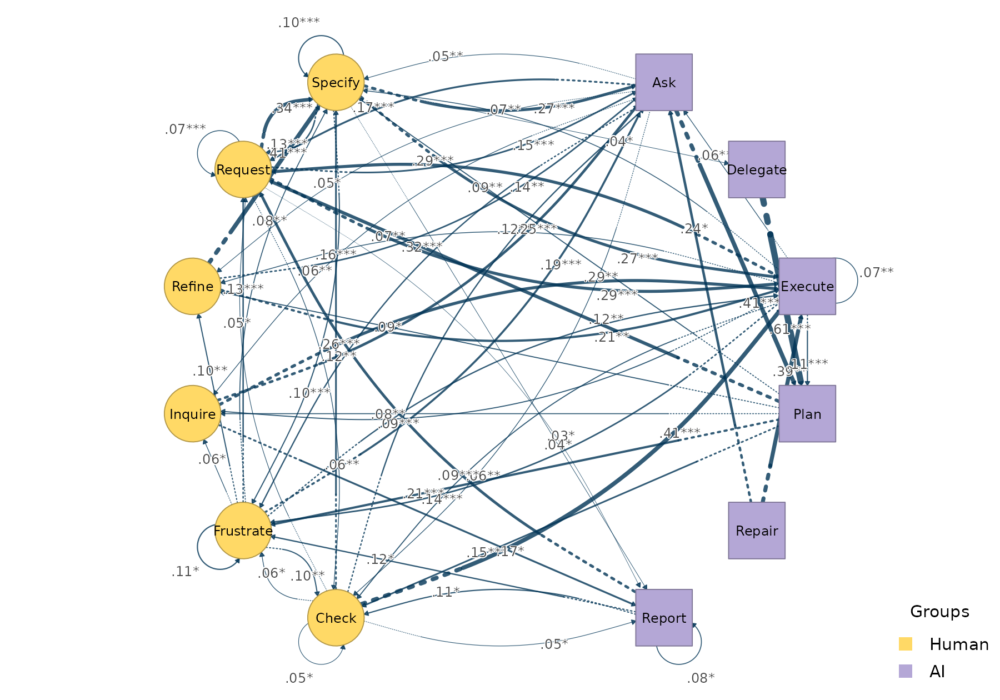

## 6. Centrality stability

The function
[`centrality_stability_htna()`](https://sonsoles.me/htna/reference/centrality_stability_htna.md)
runs a case-dropping centrality stability check: drops a proportion of
the sessions, recomputes the centralities, and measures how strongly the
dropped-sample centralities correlate with the originals. The returned
`cs` value per measure is the **largest drop proportion at which the
correlation with the original centralities still meets the threshold**
(default `0.7`) for at least `certainty` (default `0.95`) of resamples —
values above ~0.5 are typically considered stable.

``` r

cs <- centrality_stability_htna(net, iter = 100, seed = 1)
cs$cs
#>  InStrength OutStrength Betweenness 
#>         0.9         0.9         0.9
```

By default the check covers `InStrength`, `OutStrength`, and
`Betweenness` — the three measures whose values are bit-equal between
htna’s `cograph` engine and the reference implementation.

## 7. Split-half reliability

The function
[`reliability_htna()`](https://sonsoles.me/htna/reference/reliability_htna.md)
reports how stable each edge weight is under random split-half
resampling: it draws `iter` random splits of the sessions, builds a
network on each half, and summarises the agreement (mean / median / max
absolute deviation, plus correlation) between paired half-networks.

``` r

rel <- reliability_htna(net, iter = 100, seed = 1)
rel$summary
#>      model     metric        mean           sd
#> 1 relative   mean_dev 0.012458419 0.0011464861
#> 2 relative median_dev 0.007500373 0.0008826226
#> 3 relative        cor 0.982010309 0.0049162608
#> 4 relative    max_dev 0.098166765 0.0312836964
```

## 8. Comparing two networks

Given two HTNA networks built over the same node set,
[`plot_htna_diff()`](https://sonsoles.me/htna/reference/plot_htna_diff.md)
draws the edge-level pairwise difference. Positive differences are
green, negative red.

For example, we compare early vs. late sessions:

``` r

sess_start <- aggregate(session_date ~ session_id, data = human_ai,
                        FUN = min)
sess_start <- sess_start[order(sess_start$session_date,
                               sess_start$session_id), ]
half       <- nrow(sess_start) %/% 2L
early_sess <- sess_start$session_id[seq_len(half)]

early <- build_htna(human_ai[human_ai$session_id %in% early_sess, ],
                    actor_type = "actor_type")
late  <- build_htna(human_ai[!human_ai$session_id %in% early_sess, ],
                    actor_type = "actor_type")

plot_htna_diff(early, late)
```

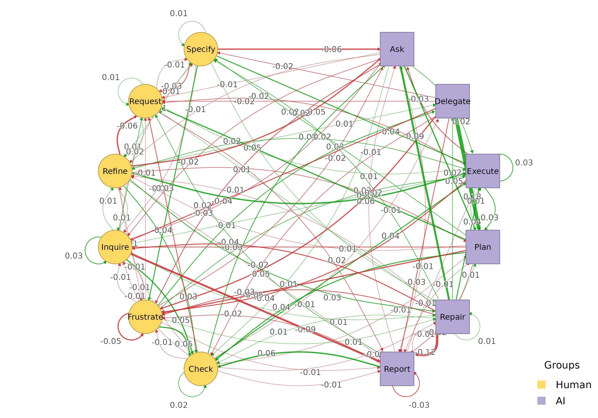

## 9. Permutation test

The function
[`permutation_htna()`](https://sonsoles.me/htna/reference/permutation_htna.md)
provides a non-parametric significance test on each edge weight
difference. Pass the result to
[`plot_htna_diff()`](https://sonsoles.me/htna/reference/plot_htna_diff.md)
to render significant differences with the pos/neg colouring above;
non-significant edges are dashed grey when `show_nonsig = TRUE`.

``` r

perm <- permutation_htna(early, late, iter = 200)
plot_htna_diff(perm)
```

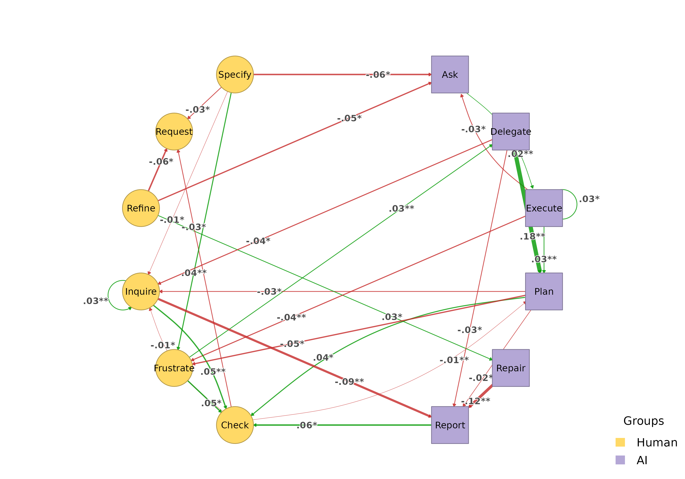

``` r

plot_htna_diff(perm, show_nonsig = TRUE)
```

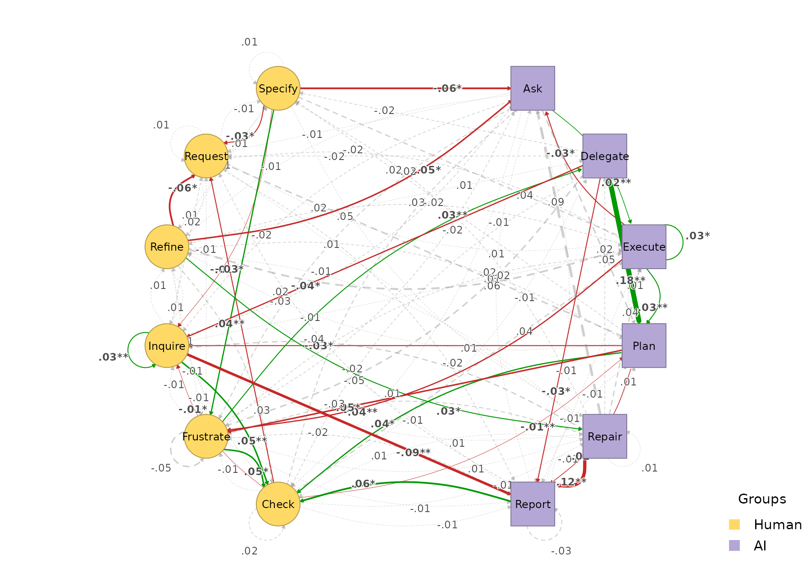

## 10. Path patterns

[`extract_meta_paths()`](https://sonsoles.me/htna/reference/extract_meta_paths.md)
discovers recurring patterns at two levels. By default it returns
concrete state-level patterns (alphabet = the code set `Ask`, `Plan`,
`Check`, …) and annotates each row with the type-level template it
instantiates:

``` r

extract_meta_paths(net, length = 3)
#> Patterns (state-level) over 429 sequences
#> Rows: 1058 | Lengths: 3 | Gaps: 0
#>                       schema         meta_schema length gap count n_seq support
#>    Request->Execute->Request    Human->AI->Human      3   0   401   194   0.452
#>    Execute->Request->Execute       AI->Human->AI      3   0   391   180   0.420
#>        Request->Specify->Ask    Human->Human->AI      3   0   344   202   0.471
#>           Specify->Ask->Plan       Human->AI->AI      3   0   340   197   0.459
#>           Ask->Plan->Request       AI->AI->Human      3   0   303   197   0.459
#>    Request->Specify->Execute    Human->Human->AI      3   0   281   152   0.354
#>    Execute->Request->Specify    AI->Human->Human      3   0   249   142   0.331
#>  Request->Specify->Frustrate Human->Human->Human      3   0   248   241   0.562
#>         Frustrate->Ask->Plan       Human->AI->AI      3   0   214   187   0.436
#>    Specify->Request->Specify Human->Human->Human      3   0   198   192   0.448
#>  frequency  lift
#>      0.022  5.00
#>      0.021  4.65
#>      0.019  6.15
#>      0.018 11.65
#>      0.016  9.77
#>      0.015  3.73
#>      0.013  3.30
#>      0.013  5.86
#>      0.012 11.71
#>      0.011  2.93
#> ... (1048 more)
```

A `schema` filters the search. Each part can be a type name (expands to
every code in that group), a concrete state, or `*`:

``` r

extract_meta_paths(net, schema = "Human->AI->Human")
#> State-level instances of schema 'Human->AI->Human' over 429 sequences
#> Rows: 163 | Lengths: 3 | Gaps: 0
#>                       schema      meta_schema length gap count n_seq support
#>    Request->Execute->Request Human->AI->Human      3   0   401   194   0.452
#>    Specify->Execute->Request Human->AI->Human      3   0   176   107   0.249
#>        Request->Ask->Request Human->AI->Human      3   0   130    91   0.212
#>      Check->Execute->Request Human->AI->Human      3   0   123    96   0.224
#>        Specify->Ask->Request Human->AI->Human      3   0   120    84   0.196
#>  Specify->Execute->Frustrate Human->AI->Human      3   0   114    88   0.205
#>  Request->Execute->Frustrate Human->AI->Human      3   0   106    88   0.205
#>    Request->Execute->Inquire Human->AI->Human      3   0    97    76   0.177
#>      Specify->Ask->Frustrate Human->AI->Human      3   0    86    70   0.163
#>    Inquire->Execute->Request Human->AI->Human      3   0    73    52   0.121
#>  frequency lift
#>      0.112 5.00
#>      0.049 2.33
#>      0.036 2.19
#>      0.034 3.67
#>      0.033 2.15
#>      0.032 2.57
#>      0.030 2.24
#>      0.027 4.40
#>      0.024 2.61
#>      0.020 3.31
#> ... (153 more)
extract_meta_paths(net, schema = "Human->Ask->*")
#> State-level instances of schema 'Human->Ask->*' over 429 sequences
#> Rows: 63 | Lengths: 3 | Gaps: 0
#>                   schema      meta_schema length gap count n_seq support
#>       Specify->Ask->Plan    Human->AI->AI      3   0   340   197   0.459
#>     Frustrate->Ask->Plan    Human->AI->AI      3   0   214   187   0.436
#>       Request->Ask->Plan    Human->AI->AI      3   0   139   106   0.247
#>    Request->Ask->Request Human->AI->Human      3   0   130    91   0.212
#>    Specify->Ask->Request Human->AI->Human      3   0   120    84   0.196
#>  Specify->Ask->Frustrate Human->AI->Human      3   0    86    70   0.163
#>       Inquire->Ask->Plan    Human->AI->AI      3   0    53    45   0.105
#>        Refine->Ask->Plan    Human->AI->AI      3   0    52    46   0.107
#>  Request->Ask->Frustrate Human->AI->Human      3   0    50    44   0.103
#>    Specify->Ask->Specify Human->AI->Human      3   0    49    41   0.096
#>  frequency  lift
#>      0.170 11.65
#>      0.107 11.71
#>      0.070  4.48
#>      0.065  2.19
#>      0.060  2.15
#>      0.043  2.61
#>      0.027  6.22
#>      0.026  6.57
#>      0.025  1.43
#>      0.025  0.93
#> ... (53 more)
```

Filter by lift to surface over-represented patterns (lift \> 1 means
more frequent than independence would predict):

``` r

extract_meta_paths(net, length = 3, min_lift = 2)
#> Patterns (state-level) over 429 sequences
#> Rows: 301 | Lengths: 3 | Gaps: 0
#>                       schema         meta_schema length gap count n_seq support
#>    Request->Execute->Request    Human->AI->Human      3   0   401   194   0.452
#>    Execute->Request->Execute       AI->Human->AI      3   0   391   180   0.420
#>        Request->Specify->Ask    Human->Human->AI      3   0   344   202   0.471
#>           Specify->Ask->Plan       Human->AI->AI      3   0   340   197   0.459
#>           Ask->Plan->Request       AI->AI->Human      3   0   303   197   0.459
#>    Request->Specify->Execute    Human->Human->AI      3   0   281   152   0.354
#>    Execute->Request->Specify    AI->Human->Human      3   0   249   142   0.331
#>  Request->Specify->Frustrate Human->Human->Human      3   0   248   241   0.562
#>         Frustrate->Ask->Plan       Human->AI->AI      3   0   214   187   0.436
#>    Specify->Request->Specify Human->Human->Human      3   0   198   192   0.448
#>  frequency  lift
#>      0.022  5.00
#>      0.021  4.65
#>      0.019  6.15
#>      0.018 11.65
#>      0.016  9.77
#>      0.015  3.73
#>      0.013  3.30
#>      0.013  5.86
#>      0.012 11.71
#>      0.011  2.93
#> ... (291 more)
extract_meta_paths(net, level = "type", length = 3, min_lift = 1.2)
#> Meta-paths (type-level) over 429 sequences
#> Rows: 3 | Lengths: 3 | Gaps: 0
#>            schema length gap count n_seq support frequency lift
#>  Human->AI->Human      3   0  3593   402   0.937     0.194 1.41
#>  Human->Human->AI      3   0  3172   422   0.984     0.172 1.25
#>     AI->Human->AI      3   0  2744   383   0.893     0.148 1.36
```
