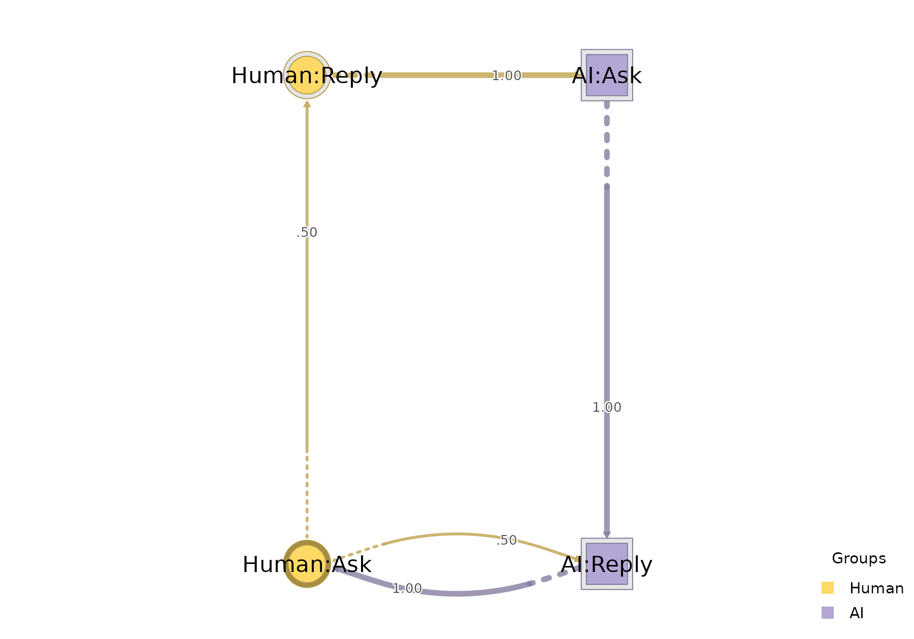
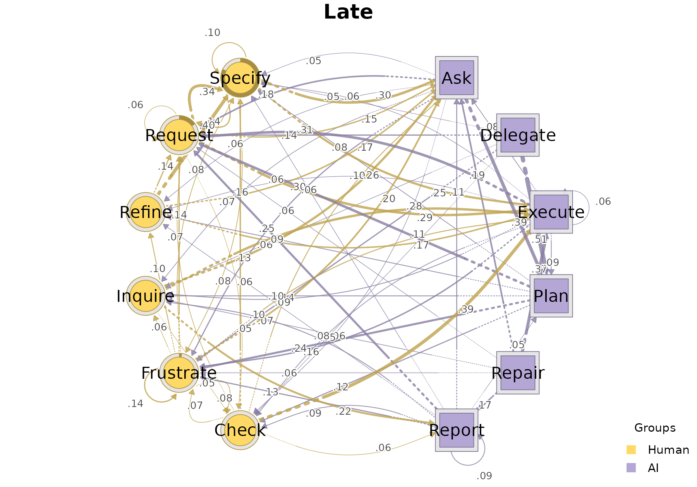
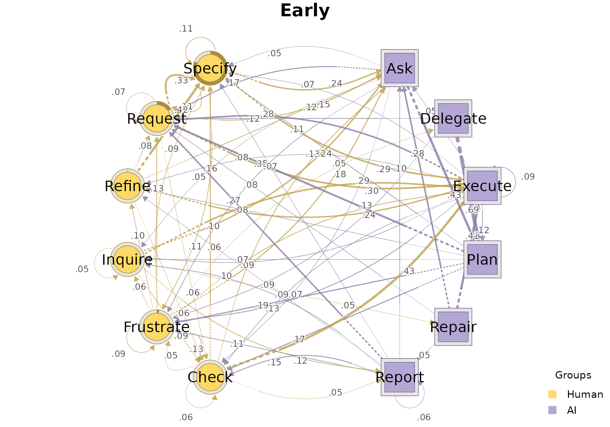

# Input formats for build_htna()

[`build_htna()`](https://sonsoles.me/htna/reference/build_htna.md)
accepts data in **three interchangeable shapes**: 1. a named list of
per-actor-type nodes 2. a single combined frame with an actor-type
column 3. a single combined frame with a node-to-actor-type dictionary.

This vignette walks through each form, shows that all three produce the
same network, and then covers two extra parameters that compose with any
input form: `disambiguate` (for code-label collisions) and `group` (for
per-cohort networks).

To keep the examples concrete, `htna` ships four bundled objects
covering every shape the vignette needs:

- `human_simplified` and `ai_simplified`: per-actor long datasets, one
  per actor type. These feed **Form 1** directly.
- `human_ai`: the same data row-bound into one long frame with an
  `actor_type` column (and a pre-computed `phase` cohort tag for the
  grouped example at the end). This feeds **Form 2** and **Form 3**.
- `human_ai_codebook` — a tidy two-column code → actor-type lookup,
  ready to pass to **Form 3**.

## Setup

``` r

library(htna)
data(human_ai)
data(human_simplified)
data(ai_simplified)
data(human_ai_codebook)
```

All three long frames share the canonical schema `htna` expects:
`actor`/`session_id`, `code`, `order_in_session`. Within each session,
`order_in_session` is a **shared** time index across both actors.

## Form 1 — Named list of per-actor frames

The most direct form. Each entry is one actor’s long frame; the list
name becomes the actor-type label on the network. The bundled
`human_simplified` and `ai_simplified` frames already have this shape —
one per actor type, sharing the canonical schema.

``` r

net_list <- build_htna(list(Human = human_simplified, AI = ai_simplified), 
                       actor = "session_id")
summary(net_list)
#> <htna network>
#>   Method:    relative
#>   Sessions:  429   (max 287 timesteps)
#>   Nodes:     12
#>   Edges:     135 / 144 (non-zero)
#> 
#> Actor types (2):
#>   Human (6 nodes):  Check, Frustrate, Inquire, Refine, Request, Specify
#>   AI    (6 nodes):  Ask, Delegate, Execute, Plan, Repair, Report
#> 
#> Edge counts by actor (rows = source, cols = target):
#>           Human    AI
#>   Human      35    36
#>   AI         36    28
```

``` r

plot_htna(net_list)
```


Use this form when each actor’s data lives in a separate frame (the
typical case when the two streams were prepared independently).

## Form 2 — Single combined frame with `actor_type`

When the data already comes as one long table, tag each row with the
actor-type and pass the column name to `actor_type =`.

``` r

net_actor_type <- build_htna(human_ai, 
                             actor_type = "actor_type", 
                             actor = "session_id", 
                             order = "order_in_session")
```

The actor-type order on the resulting network follows the factor levels
(or, for character vectors, the order of first appearance), which is how
the actor groups will be ordered in legends and plots.

## Form 3 — Single combined frame with `node_groups`

When the combined frame has **no** actor-type column, declare the
node-to-actor partition directly via `node_groups`. `node_groups`
accepts two interchangeable shapes:

### 3a. Named list of code vectors

Extract the per-actor code sets from the bundled per-actor frames and
pass them as a named list. The list names become the actor-type labels
on the network.

``` r

human_codes <- c("Specify", "Request", "Frustrate", "Check", "Inquire", "Refine")
ai_codes    <- c("Delegate", "Plan", "Execute", "Ask", "Repair", "Report")

net_node_groups <- build_htna(
  human_ai,
  actor = "session_id",
  node_groups = list(Human = human_codes, AI = ai_codes)
)
net_node_groups
#> Transition Network (relative probabilities) [directed]
#>   Weights: [0.002, 0.611]  |  mean: 0.089
#> 
#>   Weight matrix:
#>               Ask Check Delegate Execute Frustrate Inquire  Plan Refine Repair
#>   Ask       0.018 0.063    0.000   0.022     0.116   0.063 0.409  0.051  0.004
#>   Check     0.117 0.050    0.015   0.411     0.058   0.005 0.008  0.042  0.033
#>   Delegate  0.000 0.039    0.000   0.011     0.110   0.032 0.611  0.014  0.000
#>   Execute   0.061 0.087    0.000   0.074     0.143   0.088 0.107  0.069  0.002
#>   Frustrate 0.194 0.104    0.039   0.119     0.114   0.060 0.004  0.098  0.029
#>   Inquire   0.251 0.069    0.027   0.285     0.039   0.033 0.009  0.016  0.042
#>   Plan      0.000 0.146    0.000   0.015     0.215   0.083 0.003  0.086  0.005
#>   Refine    0.143 0.045    0.006   0.206     0.008   0.014 0.013  0.000  0.025
#>   Repair    0.241 0.012    0.028   0.391     0.043   0.047 0.016  0.024  0.004
#>   Report    0.102 0.114    0.000   0.009     0.124   0.102 0.050  0.058  0.039
#>   Request   0.148 0.055    0.018   0.292     0.016   0.010 0.008  0.009  0.007
#>   Specify   0.269 0.017    0.040   0.273     0.096   0.011 0.015  0.002  0.013
#>             Report Request Specify
#>   Ask        0.028   0.173   0.052
#>   Check      0.055   0.049   0.156
#>   Delegate   0.018   0.131   0.035
#>   Execute    0.010   0.293   0.065
#>   Frustrate  0.021   0.135   0.085
#>   Inquire    0.170   0.028   0.029
#>   Plan       0.026   0.325   0.095
#>   Refine     0.023   0.105   0.413
#>   Repair     0.103   0.071   0.020
#>   Report     0.077   0.257   0.066
#>   Request    0.034   0.067   0.336
#>   Specify    0.037   0.126   0.101 
#> 
#>   Initial probabilities:
#>   Specify       0.818  ████████████████████████████████████████
#>   Request       0.156  ████████
#>   Frustrate     0.023  █
#>   Refine        0.002  
#>   Ask           0.000  
#>   Check         0.000  
#>   Delegate      0.000  
#>   Execute       0.000  
#>   Inquire       0.000  
#>   Plan          0.000  
#>   Repair        0.000  
#>   Report        0.000
```

### 3b. Two-column data frame (codebook)

The same partition expressed as a tidy codebook — one row per code, one
column for the action and one for the actor type. The action column must
match the `action` parameter (default `"code"`); the other column is
treated as the actor-type tag. Column order is irrelevant.

The bundled `human_ai_codebook` already has this shape, so it can be
passed straight through:

``` r

head(human_ai_codebook)
#>        code actor_type
#> 1   Specify      Human
#> 2   Request      Human
#> 3 Frustrate      Human
#> 4     Check      Human
#> 5   Inquire      Human
#> 6    Refine      Human

net_node_groups_df <- build_htna(
  human_ai,
  session = "session_id",
  node_groups = human_ai_codebook
)
```

The actor-type ordering follows the column’s factor levels (if a factor)
or the order of first appearance (if a character vector). Use this form
when your code/actor mapping already lives in a tidy lookup table.

## All forms produce the same network

[`build_htna()`](https://sonsoles.me/htna/reference/build_htna.md)
resolves every input shape to the same combined sequence and forwards to
[`Nestimate::build_network()`](https://saqr.me/Nestimate/reference/build_network.html).
The four networks below are drawn side by side — the layout, colours,
and edges are indistinguishable:

``` r

forms <- list(
  list_form        = net_list,
  actor_type_form  = net_actor_type,
  node_groups_list = net_node_groups,
  node_groups_df   = net_node_groups_df
)

op <- par(mfrow = c(2, 2), mar = c(1, 1, 3, 1))
for (nm in names(forms)) plot_htna(forms[[nm]], title = nm)
```


``` r

par(op)
```

## Handling code-label collisions with `disambiguate =`

If both actor types share a code label (e.g. both Human and AI have a
code called `Ask` and another code called `Reply`),
[`build_htna()`](https://sonsoles.me/htna/reference/build_htna.md)
errors by default — keeping such states distinct is usually what you
want. Pass `disambiguate = TRUE` to prefix every code with its
actor-type label so the two `Ask` nodes become `Human:Ask` and `AI:Ask`.

``` r

overlap <- data.frame(
  session_id        = rep(paste0("s", 1:3), each = 6),
  code              = rep(c("Ask", "Reply", "Ask", "Reply", "Ask", "Reply"), 3),
  actor_type        = rep(c("Human", "Human", "AI", "AI", "Human", "AI"), 3),
  order_in_session  = rep(1:6, 3),
  stringsAsFactors  = FALSE
)

# Without disambiguate=, this errors:
try(build_htna(overlap, actor_type = "actor_type"))
#> Error : Code(s) appear in more than one actor group: Ask, Reply. Pass `disambiguate = TRUE` to prefix codes with the actor label.

# With disambiguate=, the two `Ask`s become distinct nodes:
net_dis <- build_htna(overlap, actor_type = "actor_type",
                      disambiguate = TRUE)
net_dis$nodes$label
#> [1] "AI:Ask"      "AI:Reply"    "Human:Ask"   "Human:Reply"
plot(net_dis)
```



## Splitting into cohorts with `group =`

Any of the three input forms can additionally be split into per-cohort
networks by passing `group =` — the result is an `htna_group`, one
`htna` network per level of the grouping column. `human_ai` already
ships with a `phase` column tagging each session as `Early` or `Late` (a
chronological split: first-half of sessions = early, rest = late), so
the cohort build is a one-liner:

``` r

grp <- build_htna(human_ai, actor_type = "actor_type", group = "phase")
class(grp)
#> [1] "htna_group"      "netobject_group" "list"
names(grp)
#> [1] "Late"  "Early"
```

``` r

plot_htna(grp)
```



## Cheat sheet

| Form | When to use |
|----|----|
| `list(Actor1 = a1, Actor2 = a2)` | Each actor’s data is in its own frame |
| `df, actor_type = "actor_type"` | One combined frame, actor identity in a row-level column |
| `df, node_groups = list(Actor1 = ..., Actor2 = ...)` | One combined frame; partition declared as a named list of codes |
| `df, node_groups = data.frame(code = ..., actor_type = ...)` | One combined frame; partition declared as a tidy codebook |
| `+ actor = "user_id"` | Identify the individual actor that performed each event (forwarded to [`Nestimate::build_network()`](https://saqr.me/Nestimate/reference/build_network.html)) |
| `+ disambiguate = TRUE` | Same code label appears in more than one actor type |
| `+ group = "phase"` | Build one network per cohort/phase |

All three input shapes are interchangeable; pick whichever matches the
shape your data already has.
