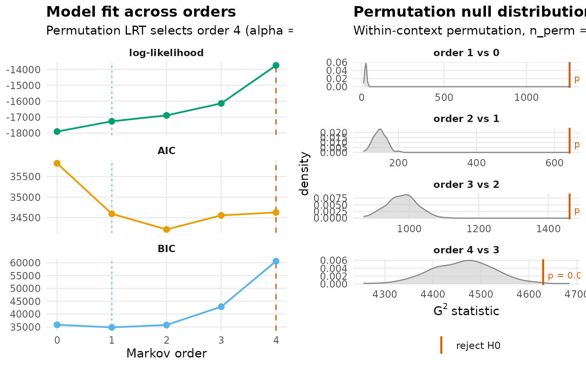
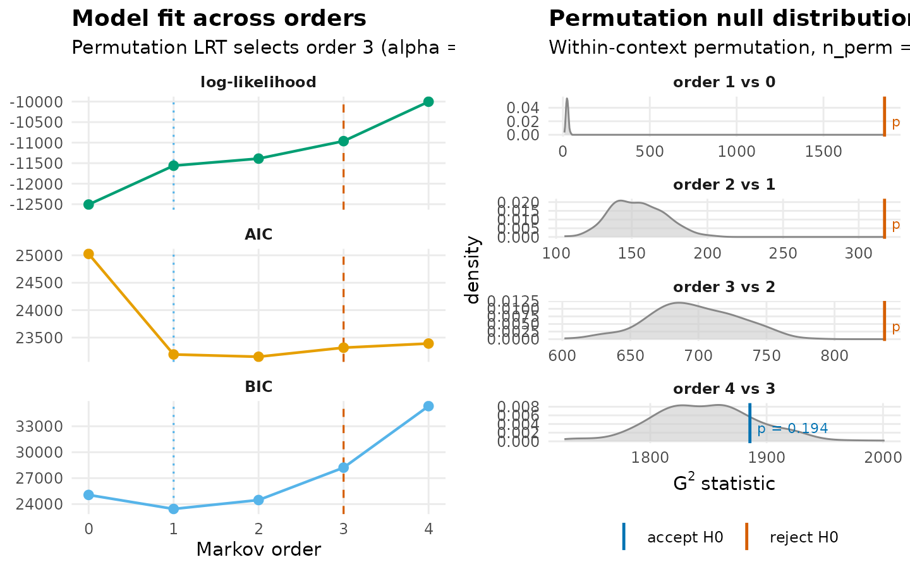
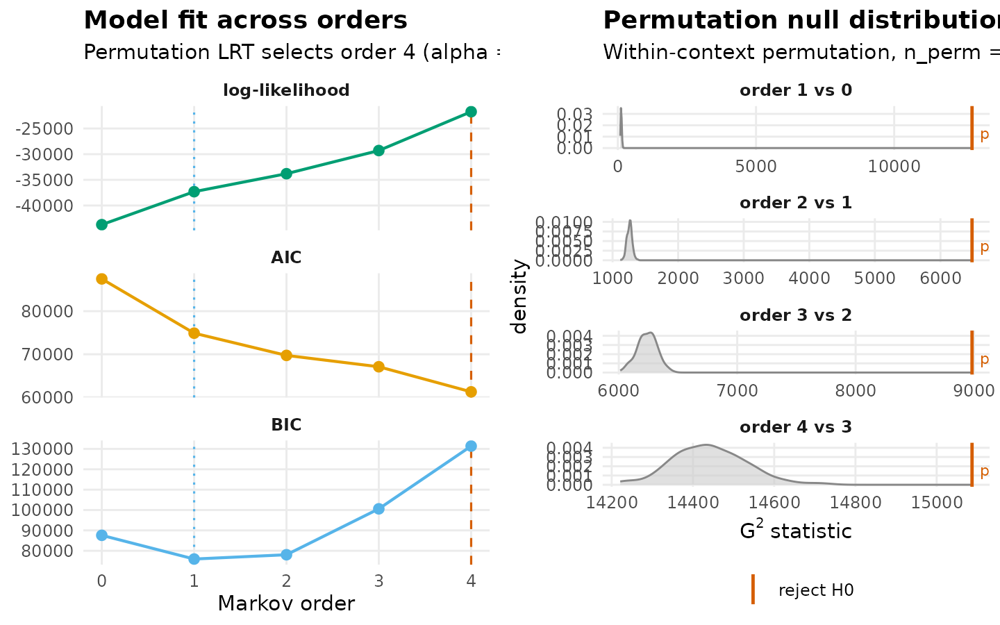

# Markov-order adequacy in heterogeneous transition networks

A first-order Markov network represents the transition probability
between consecutive states under the assumption that the next state
depends only on the current state and not on any earlier ones. This
assumption is convenient — it reduces a temporal process to a square
transition matrix and supports the entire htna analytic stack — but it
is also empirical. For some corpora, the data demand a higher order: the
next state depends jointly on the current and on one or more preceding
states, and a first-order model misrepresents the dependence structure.

[`markov_order_test_htna()`](https://sonsoles.me/htna/reference/markov_order_test_htna.md)
quantifies that demand. For a fixed range of candidate orders, it fits a
separate Markov model at each order to the empirical sequences, computes
the log-likelihood, and tests whether each successive increase in order
yields a statistically significant improvement over the lower order via
a permutation test on the deviance statistic. The reported optimal order
is the largest order at which the test rejects equivalence to its
predecessor.

In a heterogeneous setting (where two or more actors interleave in the
same session) the question gains an additional dimension. The optimal
order computed on the *combined* sequences is a property of the joint
Human-AI process. The optimal orders computed on the *per-actor*
sequences (extracting only one actor’s events from each session) are
properties of each actor’s own process. The two are not guaranteed to
agree. When they disagree, the disagreement is substantive: it locates
the temporal dependence in one actor’s behaviour rather than in the
joint dynamics.

This vignette runs the test under three slicings of the example Human-AI
corpus and compares the resulting optimal orders.

## Data and three slicings

The example uses the bundled `human_ai` corpus – Human + AI events in a
single long frame, tagged by an `actor_type` column (see
[`?human_ai`](https://sonsoles.me/htna/reference/human_ai.md)). Three
sequence sets are constructed:

- **Human-only**: each session restricted to its Human events,
  preserving order.
- **AI-only**: each session restricted to its AI events, preserving
  order.
- **Combined**: the original interleaved Human + AI sequence per
  session.

Sessions shorter than three events do not inform tests beyond order-1
and are excluded from each set.

``` r

library(htna)
data(human_ai)

# Within each session, restore chronological order (the bundled
# dataset is sorted by project + step, which interleaves sessions).
human_ai <- human_ai[order(human_ai$session_id,
                           human_ai$order_in_session), ]

is_h <- human_ai$actor_type == "Human"
human_seqs <- split(human_ai$code[is_h], human_ai$session_id[is_h])
human_seqs <- human_seqs[lengths(human_seqs) >= 3L]

is_a <- human_ai$actor_type == "AI"
ai_seqs <- split(human_ai$code[is_a], human_ai$session_id[is_a])
ai_seqs <- ai_seqs[lengths(ai_seqs) >= 3L]

combined_seqs <- split(human_ai$code, human_ai$session_id)
combined_seqs <- combined_seqs[lengths(combined_seqs) >= 3L]

c(human = length(human_seqs),
  ai    = length(ai_seqs),
  combined = length(combined_seqs))
#>    human       ai combined 
#>      423      416      427
```

## Human sequences

The Human-only test asks whether the temporal dependence among Human
codes extends beyond order-1. The hypothesis at each order *k* is that
order-(*k*-1) is sufficient against the alternative that order-*k*
captures additional structure.

``` r

mo_h <- markov_order_test_htna(
  human_seqs,
  max_order = 4L,
  n_perm    = 200L,
  seed      = 1L
)
mo_h$test_table
#>   order    loglik      AIC      BIC   df        g2 p_permutation  p_asymptotic
#> 1     0 -17907.30 35824.60 35861.03   NA        NA            NA            NA
#> 2     1 -17262.70 34595.39 34850.41   25 1260.7611   0.004975124 1.978771e-250
#> 3     2 -16892.01 34214.01 35780.55  150  638.5035   0.004975124  1.782493e-61
#> 4     3 -16136.73 34557.47 42878.30  900 1461.4352   0.004975124  2.008114e-29
#> 5     4 -13751.30 34628.60 60589.30 4111 4629.4962   0.009950249  1.884830e-08
#>   significant
#> 1          NA
#> 2        TRUE
#> 3        TRUE
#> 4        TRUE
#> 5        TRUE
mo_h$optimal_order
#> [1] 4
```

``` r

plot(mo_h)
```



## AI sequences

The AI-only test asks the same question of the AI codes independently,
on the same scale of `max_order` and number of permutations. The result
does not depend on the Human sequences and is therefore directly
comparable to the Human result.

``` r

mo_a <- markov_order_test_htna(
  ai_seqs,
  max_order = 4L,
  n_perm    = 200L,
  seed      = 1L
)
mo_a$test_table
#>   order    loglik      AIC      BIC   df        g2 p_permutation p_asymptotic
#> 1     0 -12507.50 25025.00 25060.26   NA        NA            NA           NA
#> 2     1 -11561.26 23192.52 23439.32   25 1851.6662   0.004975124 0.000000e+00
#> 3     2 -11388.43 23150.86 24469.46  150  317.0789   0.004975124 5.088532e-14
#> 4     3 -10962.98 23315.97 28216.65  675  836.7299   0.004975124 1.976688e-05
#> 5     4 -10002.71 23391.42 35329.35 1761 1885.6450   0.194029851 1.951552e-02
#>   significant
#> 1          NA
#> 2        TRUE
#> 3        TRUE
#> 4        TRUE
#> 5       FALSE
mo_a$optimal_order
#> [1] 3
```

``` r

plot(mo_a)
```



## Combined sequences

The combined test treats the interleaved Human-AI sequence as a single
process over the union of state vocabularies. Higher-order dependence in
this view can arise from within-actor structure (captured by the
per-actor tests) or from cross-actor dependence (an AI code reliably
following a particular Human code or vice versa) that the per-actor
tests cannot see.

``` r

mo_c <- markov_order_test_htna(
  combined_seqs,
  max_order = 4L,
  n_perm    = 200L,
  seed      = 1L
)
mo_c$test_table
#>   order    loglik      AIC       BIC    df        g2 p_permutation p_asymptotic
#> 1     0 -43738.00 87498.01  87584.58    NA        NA            NA           NA
#> 2     1 -37312.20 74892.39  75946.99   121 12815.693   0.004975124 0.000000e+00
#> 3     2 -33808.86 69731.72  78050.45  1272  6481.756   0.004975124 0.000000e+00
#> 4     3 -29294.11 67098.21 100585.65  7242  8982.768   0.004975124 1.533371e-41
#> 5     4 -21727.12 61270.24 131377.42 16296 15087.014   0.004975124 1.000000e+00
#>   significant
#> 1          NA
#> 2        TRUE
#> 3        TRUE
#> 4        TRUE
#> 5        TRUE
mo_c$optimal_order
#> [1] 4
```

``` r

plot(mo_c)
```



## Comparative interpretation

The three optimal orders, considered together, partition the temporal
dependence in the corpus across actors and across the joint process.
Four interpretive cases are worth distinguishing:

| Pattern | Interpretation |
|----|----|
| All three optimal orders ≈ 1 | First-order htna network is well-specified; both actors and their interaction are memoryless at the resolution of this test. |
| Combined \> both per-actor | The joint process carries dependence that neither actor’s behaviour explains in isolation. The temporal structure resides in *cross-actor coupling* — turn-taking, response patterns, action-reaction loops. |
| One per-actor \> the other and ≥ combined | The actor with the higher order is the one with internal long-range dependence. Their behaviour at step *t* depends on multiple prior steps of *their own* history, regardless of what the other actor did. |
| Per-actor orders ≥ combined | The per-actor processes individually carry more memory than their interleaved joint process. This is unusual and typically indicates that the combined sequence dilutes within-actor structure by alternating actors. |

Empirically, on the example corpus the Human-only optimal order is **4**
and the AI-only optimal order is **3**. The combined optimal order is
**4**. All three saturate at the upper bound of the search (see the next
section), so the test cannot distinguish which process carries the
deepest internal memory at this `max_order` — only that none of them is
consistent with a first-order assumption. The default htna network is
therefore a structural simplification of these data, even if it remains
analytically useful for descriptive and relational claims.

## A note on `optimal_order` saturating at `max_order`

When all tested orders show significant improvement over their
predecessor — as in this example — the reported `optimal_order` equals
the upper bound of the search (`max_order`). This is not the “true”
optimal order; it is the largest order tested. To probe whether higher
orders would still improve fit, increase `max_order`. The trade-off is
computational: the number of parameters at order *k* is approximately
$`|S|^{k+1}`$, where $`|S|`$ is the size of the state alphabet, so each
step roughly multiplies fitting cost by the alphabet size.

## Practical recipe

1.  Run the test at `max_order = 3` initially as a coarse screen.
2.  If the optimal order saturates at the upper bound, increase
    `max_order` until the test reports a non-significant step.
3.  For heterogeneous corpora, compute the test on per-actor and
    combined sequences separately, and consult the comparative table
    above.
4.  If `optimal_order = 1` for the combined process, the htna
    first-order network is well-specified for the corpus.
5.  If `optimal_order > 1` for the combined process but
    `optimal_order = 1` for each actor in isolation, the higher-order
    structure resides in cross-actor coupling. The first-order htna
    network captures aggregate transition patterns but understates the
    temporal coordination between actors.
6.  If `optimal_order > 1` per-actor, the first-order htna network is
    structurally simplifying the dependence. The next section surveys
    principled alternatives.

## Alternatives when the first-order assumption is rejected

htna is a focused subset of the Nestimate ecosystem and does not
implement higher-order or non-Markovian network models directly. When
[`markov_order_test_htna()`](https://sonsoles.me/htna/reference/markov_order_test_htna.md)
indicates that the first-order assumption is inadequate, the analysis
proceeds by constructing the appropriate alternative model in Nestimate
or, for selected variants, in `tna`. The choice of alternative is
determined by the mechanism through which the first-order assumption
fails.

### Higher-order Markov networks

If the rejection of order-1 reflects genuine dependence of the next
state on multiple preceding states, a higher-order Markov network is the
appropriate generalisation. Several constructors in Nestimate implement
higher-order models under different encodings of the memory:

| Function | Description |
|----|----|
| [`Nestimate::build_hon()`](https://saqr.me/Nestimate/reference/build_hon.html) | Higher-order network constructed by introducing explicit memory nodes for sequences whose transition probabilities deviate from the first-order baseline. Appropriate when the optimal order is 2 or 3 and the analysis benefits from an explicit memory representation in the graph. |
| [`Nestimate::build_honem()`](https://saqr.me/Nestimate/reference/build_honem.html) | Higher-order network with memory encoded on edges rather than as expanded nodes. Yields a graph of the same node cardinality as the first-order network, with the trade-off that memory information is no longer locally readable from individual nodes. |
| [`Nestimate::build_hypa()`](https://saqr.me/Nestimate/reference/build_hypa.html) | Higher-order network restricted to memory effects that are significant against a hypergeometric null model. Reduces the risk of over-fitting that arises when high-order transitions are estimated from limited data. |
| [`Nestimate::build_mogen()`](https://saqr.me/Nestimate/reference/build_mogen.html) | Multi-order generative model in which the order is selected per node rather than fixed globally. Appropriate when memory depth is heterogeneous across states. |

``` r

hon <- Nestimate::build_hon(combined_seqs, max_order = 2L)
```

The actor partition carried by an htna network is not preserved on
higher-order objects, because the partition is defined on single-state
nodes whereas higher-order models extend the node set with memory
configurations that have no direct actor identity. Downstream analyses
on a higher-order network therefore proceed without partition-aware
visualisation.

### Markov mixture models

A second mechanism by which the first-order test may reject the null is
corpus heterogeneity: the sample comprises several distinct first-order
processes whose mixture exhibits apparent higher-order structure even
though no individual process does. The
[`Nestimate::build_mmm()`](https://saqr.me/Nestimate/reference/build_mmm.html)
constructor estimates a *k*-component mixture of first-order chains and
assigns each session probabilistically to a component.

| Function | Description |
|----|----|
| [`Nestimate::build_mmm()`](https://saqr.me/Nestimate/reference/build_mmm.html) | Mixture of *k* first-order Markov chains with EM-based estimation. Each session receives posterior probabilities of membership in each component. Diagnostic of mixture rather than higher-order structure: the per-session log-likelihood improvement under a higher-order model is concentrated in a subset of sessions rather than uniformly distributed across the corpus. |

``` r

mmm <- Nestimate::build_mmm(combined_seqs, k = 3L)
```

### TNA-family alternatives

Some apparent rejections of order-1 reflect not a Markov-order problem
but a transition-aggregation problem: the empirical transitions exist
but are weighted, thresholded, or attended to in ways that the
first-order relative-probability scheme does not express. The family of
estimations re-defines the transition matrix under alternative
aggregation rules without invoking higher-order memory.

| Method | Description |
|----|----|
| `method = "attention"` | Attention-weighted transition network. Each transition is weighted by an attention coefficient that decays with sequential distance, yielding a continuous interpolation between first-order and longer-range coupling. |
| `method = "frequency"` | Frequency-thresholded transition network. Transitions below a configurable count are removed before estimation, restricting the model to a structurally robust subgraph. Appropriate when the first-order test passes overall but the network is dominated by sparse, low-evidence edges. |

These methods address the modelling-specification question (“what
transition matrix represents this corpus?”) rather than the
order-adequacy question (“does this corpus require memory?”). They are
therefore complementary to the higher-order constructors above rather
than substitutes for them.

### Diagnostic summary

| Diagnostic from [`markov_order_test_htna()`](https://sonsoles.me/htna/reference/markov_order_test_htna.md) | Indicated next step |
|----|----|
| Optimal order = 1 across all slicings | First-order htna network is well-specified; no model change is indicated. |
| Optimal order \> 1 in the combined process only | Cross-actor coupling carries dependence absent from each actor in isolation. Either retain the first-order network as a descriptive aggregate, or estimate [`Nestimate::build_hon()`](https://saqr.me/Nestimate/reference/build_hon.html) to represent the cross-actor memory explicitly. |
| Optimal order \> 1 within one or both actors | Within-actor memory. [`Nestimate::build_hon()`](https://saqr.me/Nestimate/reference/build_hon.html) or [`Nestimate::build_honem()`](https://saqr.me/Nestimate/reference/build_honem.html) per actor, or [`Nestimate::build_mogen()`](https://saqr.me/Nestimate/reference/build_mogen.html) when memory depth varies across states. |
| Optimal order saturates at `max_order` for large `max_order` | Test the corpus-mixture hypothesis with [`Nestimate::build_mmm()`](https://saqr.me/Nestimate/reference/build_mmm.html); high apparent order may reflect heterogeneous components rather than long memory. |
| First-order assumption holds but edges are sparse and noisy | Aggregation-specification rather than order question: `build_htna(..., method = "frequency")` to restrict to structurally robust transitions. |

## References

Saqr, M., López-Pernas, S., Törmänen, T., Kaliisa, R., Misiejuk, K., &
Tikka, S. (2025). Transition network analysis: A novel framework for
modeling, visualizing, and identifying the temporal patterns of learners
and learning processes. Proceedings of the 15th International Learning
Analytics and Knowledge Conference, 351–361.
<https://doi.org/10.1145/3706468.3706513>

Tutz, G. (2012). Regression for categorical data series number.
Cambridge University Press. <https://doi.org/10.1017/cbo9780511842061>
