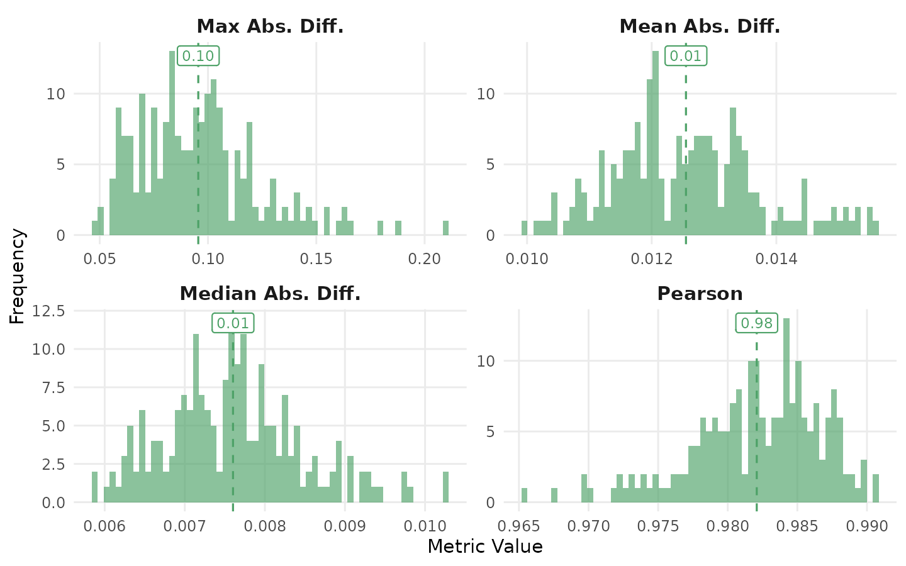
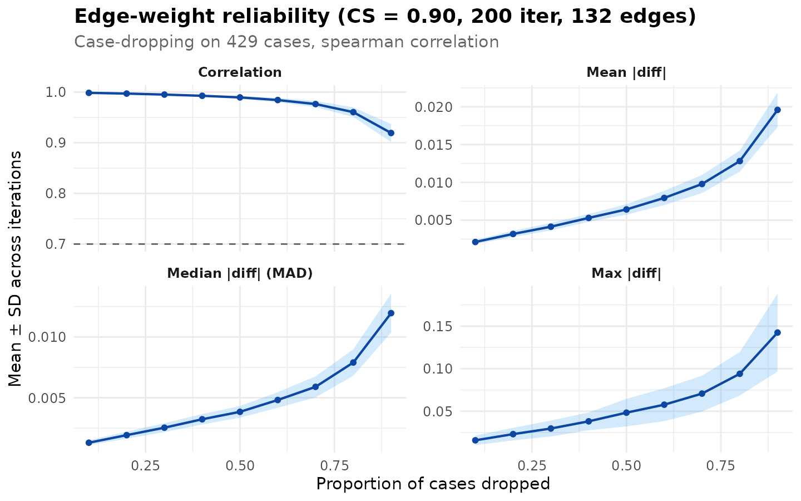
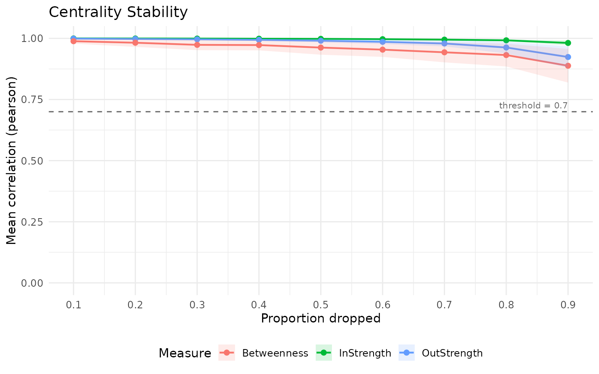
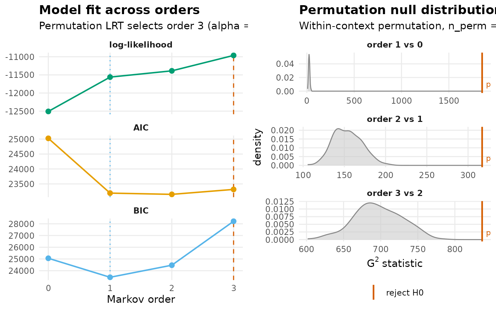

# Model assessment for htna networks

A heterogeneous transition network is a sample-based estimate of a
generative process. Each edge weight is a statistic computed from the
observed sequences, and as with any statistic the value carries sampling
variability. Interpretive claims drawn from a single estimate — that an
edge is strong, that one node is more central than another, that a
particular state dominates a phase of the trajectory — depend on
assumptions about that variability. Model assessment is the procedure by
which those assumptions are quantified, before the network is used as
evidence.

Four assessments are commonly applied to transition networks (Saqr et
al., 2025) and are exposed by the htna package as wrappers around the
`Nestimate` implementations:

1.  **Split-half reliability**: estimates the agreement between two
    networks built from independent halves of the corpus.
2.  **Edge-weight case-dropping stability**: estimates the proportion of
    cases that may be removed before the rank-ordering of edge weights
    deteriorates.
3.  **Centrality stability**: estimates the proportion of cases that may
    be removed before node-level centrality rankings cease to be stable.
4.  **Markov-order adequacy**: tests whether a first-order Markov model
    is sufficient to describe the observed transitions, or whether
    higher-order dependencies are required.

Each assessment is computed by a single function and visualised by
calling [`plot()`](https://rdrr.io/r/graphics/plot.default.html) on the
result. The htna wrappers preserve the actor partition (`$node_groups`,
`$actor_levels`) on resampled networks, so the assessment results remain
compatible with downstream htna-aware analysis.

## Data and baseline network

The example uses the bundled `human_ai` corpus – Human + AI events in a
single long frame, tagged by an `actor_type` column (see
[`?human_ai`](https://sonsoles.me/htna/reference/human_ai.md)). The
default htna network is constructed under the relative-probability
scheme (`method = "relative"`); the Markov-order test operates directly
on the raw sequence data.

``` r

library(htna)
data(human_ai)

net <- build_htna(human_ai, actor_type = "actor_type")
```

## Split-half reliability

Split-half reliability quantifies the consistency of the network
estimate across random partitions of the corpus. At each iteration, the
sessions are partitioned uniformly at random into two halves; a network
is estimated on each half; and four discrepancy metrics are computed
between the two estimates: mean absolute deviation, median absolute
deviation, maximum absolute deviation, and the Pearson correlation
between the flattened edge-weight vectors. The procedure is repeated
`iter` times and the metrics are summarised across iterations.

The Pearson correlation provides a one-number summary of similarity.
Values above 0.95 indicate near-identical estimates between halves;
values between 0.90 and 0.95 indicate substantively similar estimates
with minor sample-dependent variation; values below 0.85 indicate that
interpretation should be tempered.

``` r

rel <- reliability_htna(net, iter = 200L, seed = 1L)
rel
#> Split-Half Reliability (200 iterations, split = 50%)
#>   Mean Abs. Diff.     mean = 0.0125  sd = 0.0012
#>   Median Abs. Diff.   mean = 0.0076  sd = 0.0009
#>   Pearson             mean = 0.9821  sd = 0.0047
#>   Max Abs. Diff.      mean = 0.0955  sd = 0.0280
```

``` r

plot(rel)
```



## Edge-weight case-dropping stability

Case-dropping stability refines reliability by quantifying how much of
the sample may be removed before the *ordering* of edge weights changes.
For each drop proportion in a fixed grid (default: 0.1 to 0.9 in steps
of 0.1), a fraction of the sessions is removed at random, the network is
re-estimated, and the rank correlation (Spearman by default;
configurable via `method =`) between the flattened edge-weight vector
(off-diagonal by default; see `include_diag`) of the reduced network and
the original is recorded. The procedure is repeated `iter` times per
drop proportion.

The CS-coefficient (Epskamp et al., 2018) is defined as the maximum drop
proportion at which the rank correlation remains above `threshold`
(default 0.7) in at least `certainty` of the iterations (default 0.95).
A coefficient of 0.5 indicates that the edge ranking is robust to
removing half of the sample. Conventional cut-offs (Epskamp et al.,
2018) treat CS \> 0.25 as acceptable and CS \> 0.5 as preferred for
inferential use.

``` r

cd <- casedrop_reliability_htna(net, iter = 200L, seed = 1L)
cd
#> Edge-weight Case-dropping Stability
#>   Cases (rows of $data) : 429
#>   Edges assessed        : 132 (diagonal excluded)
#>   Iterations / prop     : 200
#>   Correlation method    : spearman
#>   CS-coefficient (r)    : 0.90  (threshold=0.70, certainty=0.95)
#> 
#> Model-level reliability across iterations (mean +/- sd per drop):
#>   drop_prop      p=0.1        p=0.2        p=0.3        p=0.4        p=0.5        p=0.6        p=0.7        p=0.8        p=0.9      
#>   mean|diff|      0.002+- 0.000   0.003+- 0.000   0.004+- 0.000   0.005+- 0.001   0.006+- 0.001   0.008+- 0.001   0.010+- 0.001   0.013+- 0.001   0.020+- 0.002
#>   MAD             0.001+- 0.000   0.002+- 0.000   0.003+- 0.000   0.003+- 0.000   0.004+- 0.000   0.005+- 0.001   0.006+- 0.001   0.008+- 0.001   0.012+- 0.002
#>   cor             0.999+- 0.000   0.997+- 0.001   0.995+- 0.001   0.993+- 0.002   0.990+- 0.003   0.984+- 0.004   0.976+- 0.006   0.960+- 0.009   0.919+- 0.018
#>   max|diff|       0.016+- 0.006   0.023+- 0.007   0.030+- 0.009   0.038+- 0.010   0.048+- 0.016   0.058+- 0.019   0.071+- 0.021   0.094+- 0.026   0.142+- 0.046
```

``` r

plot(cd)
```



The four-panel display shows the across-iteration mean of each metric
(mean / median / maximum absolute deviation, and rank correlation)
across drop proportions, with ribbons at ±1 SD across iterations. The
dashed reference line on the correlation panel marks the threshold used
to compute the CS-coefficient.

## Centrality stability

Reliability and case-dropping stability address the network as a whole
and the edge ranking, respectively. Centrality stability addresses the
node-level summaries that are commonly the target of substantive
interpretation. Many studies that report on transition networks do not
interpret individual edges; they interpret rankings of nodes by
centrality measures such as in-strength, out-strength, or betweenness.
Such rankings are only safely interpretable when they are themselves
stable under resampling.

[`centrality_stability_htna()`](https://sonsoles.me/htna/reference/centrality_stability_htna.md)
applies the case-dropping procedure to node-level centralities,
computing each measure at every iteration and quantifying the rank
consistency of nodes across iterations. The CS-coefficient is reported
per measure.

``` r

cs <- centrality_stability_htna(
  net,
  measures = c("InStrength", "OutStrength", "Betweenness"),
  iter     = 200L,
  seed     = 1L
)
cs
#> HTNA Centrality Stability Analysis
#> ===================================
#> Centrality Stability (200 iterations, threshold = 0.7)
#>   Drop proportions: 0.1, 0.2, 0.3, 0.4, 0.5, 0.6, 0.7, 0.8, 0.9
#> 
#>   CS-coefficients:
#>     InStrength       0.90
#>     OutStrength      0.90
#>     Betweenness      0.90
```

``` r

plot(cs)
```



In-strength and out-strength are typically more stable than path-based
measures because they aggregate weighted incoming and outgoing edges
directly. Betweenness depends on shortest paths and is sensitive to
small changes in edge weights that re-route many paths simultaneously;
consequently, its CS-coefficient is often substantially lower than that
of strength-based measures. Interpretation by ranking should be limited
to measures whose CS-coefficient meets the conventional threshold.

By default
[`centrality_stability_htna()`](https://sonsoles.me/htna/reference/centrality_stability_htna.md)
evaluates only the three measures that produce numerically identical
results between cograph and Nestimate (`InStrength`, `OutStrength`,
`Betweenness`). The remaining six htna centrality measures (closeness
variants, RSP betweenness, diffusion, weighted clustering) may be
assessed by supplying a custom `centrality_fn` argument.

## Markov-order adequacy

The preceding three assessments take the model — a first-order Markov
transition network — as a given and characterise its sample-based
variability. Markov-order adequacy addresses a more fundamental
question: whether the first-order assumption itself is appropriate for
the observed sequences.

[`markov_order_test_htna()`](https://sonsoles.me/htna/reference/markov_order_test_htna.md)
tests the empirical transition structure against orders 1, 2, …,
`max_order` via permutation. For each candidate order *k*, the null
hypothesis is that order-(*k*-1) is sufficient; the alternative is that
order-*k* captures dependencies beyond what order-(*k*-1) explains. The
smallest order whose test fails to reject the null is reported as the
optimal order.

The test operates on raw sequence data rather than on the htna network
object, since it requires the empirical sequences directly.

``` r

# Restore per-session chronological order (the bundled dataset is
# sorted by project + step, which interleaves sessions), then take
# the AI-only events.
ai_only <- human_ai[order(human_ai$session_id,
                          human_ai$order_in_session), ]
ai_only <- ai_only[ai_only$actor_type == "AI", ]
seqs    <- split(ai_only$code, ai_only$session_id)
seqs    <- seqs[lengths(seqs) >= 3L]
length(seqs)
#> [1] 416
```

Sequences shorter than three events do not inform tests beyond order-1
and are excluded.

``` r

mo <- markov_order_test_htna(seqs, max_order = 3L, n_perm = 200L,
                             seed = 1L)
mo$test_table
#>   order    loglik      AIC      BIC  df        g2 p_permutation p_asymptotic
#> 1     0 -12507.50 25025.00 25060.26  NA        NA            NA           NA
#> 2     1 -11561.26 23192.52 23439.32  25 1851.6662   0.004975124 0.000000e+00
#> 3     2 -11388.43 23150.86 24469.46 150  317.0789   0.004975124 5.088532e-14
#> 4     3 -10962.98 23315.97 28216.65 675  836.7299   0.004975124 1.976688e-05
#>   significant
#> 1          NA
#> 2        TRUE
#> 3        TRUE
#> 4        TRUE
mo$optimal_order
#> [1] 3
```

``` r

plot(mo)
```



If `optimal_order > 1`, the first-order network is misspecified for the
corpus, and a higher-order model is indicated. htna does not implement
higher-order networks directly; users who require them may construct
higher-order or memory-augmented models via
[`Nestimate::build_hon()`](https://saqr.me/Nestimate/reference/build_hon.html)
or
[`Nestimate::build_mogen()`](https://saqr.me/Nestimate/reference/build_mogen.html).

## Joint interpretation

The four assessments are complementary, addressing distinct levels of
the inferential chain:

| Assessment | Quantity assessed | Conventional pass criterion |
|----|----|----|
| Split-half reliability | Whole-network estimate | mean correlation \> 0.95 |
| Edge-weight case-drop | Edge-rank ordering | CS-coefficient \> 0.5 |
| Centrality stability | Node-rank ordering | CS-coefficient \> 0.5 per measure |
| Markov-order test | Model specification | optimal order = 1 |

A network that meets all four criteria supports interpretation at every
level — whole network, individual edges, node rankings, and underlying
model. A failure on any single criterion identifies the level at which
inferential claims should be qualified.

## References

Epskamp, S., Borsboom, D., & Fried, E. I. (2018). Estimating
psychological networks and their accuracy: A tutorial paper. *Behavior
Research Methods*, 50(1), 195-212.

Saqr, M., et al. (2025). Transition network analysis: A novel framework
for modeling, visualizing, and identifying the temporal patterns of
learners and learning processes.
