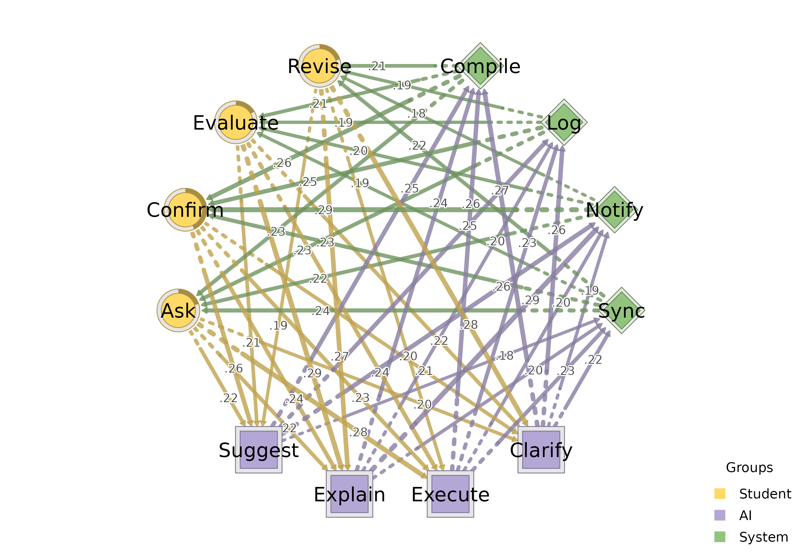
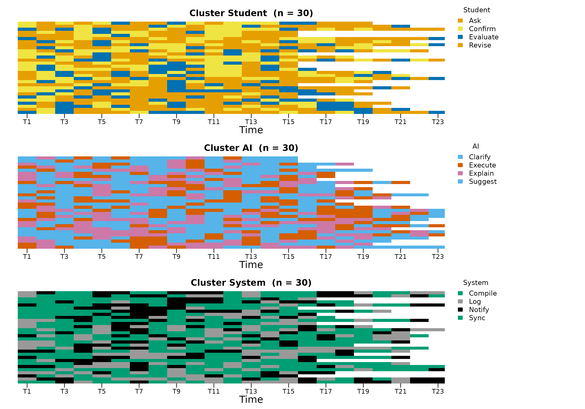
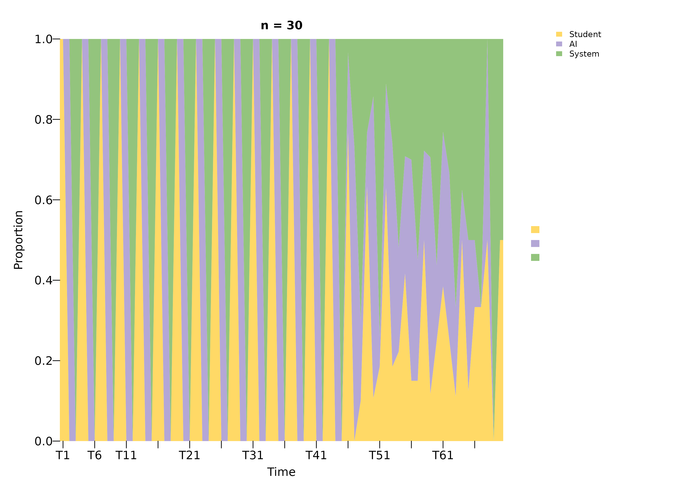
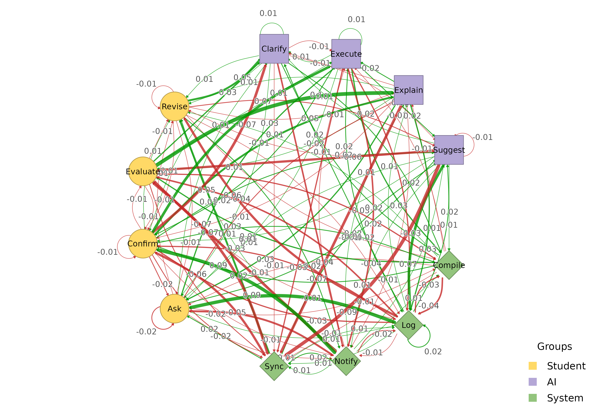
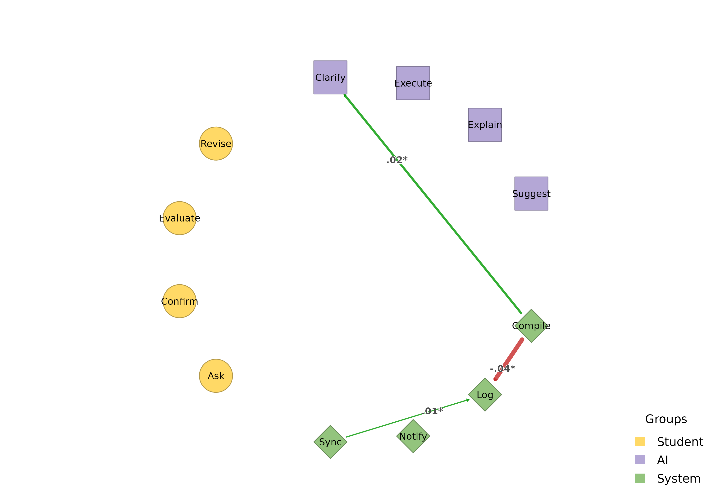
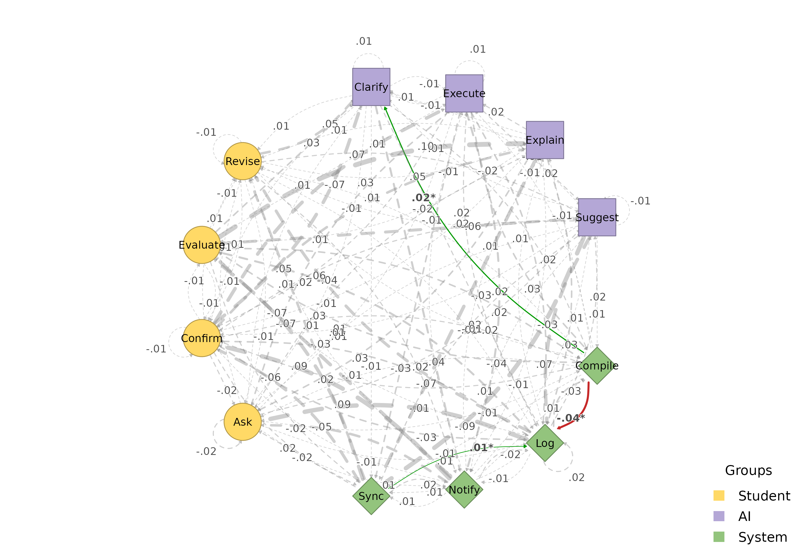

# Multi-Group HTNA (3+ Actor Groups)

HTNA is not limited to two actor groups. This vignette demonstrates how
to build and visualise a heterogeneous transition network with three
groups.

## Simulating a three-actor interaction

We simulate a collaborative coding session with three actors – a
Student, an AI assistant, and a System (e.g. IDE or automated tooling) –
each with four distinct codes:

``` r

library(htna)

set.seed(42)

student_codes <- c("Ask", "Confirm", "Revise", "Evaluate")
ai_codes      <- c("Suggest", "Explain", "Execute", "Clarify")
system_codes  <- c("Log", "Notify", "Compile", "Sync")
sessions      <- paste0("S", sprintf("%03d", 1:30))

make_events <- function(codes, sessions, offset) {
  rows <- lapply(sessions, function(sid) {
    n <- sample(15:25, 1)
    data.frame(
      session_id       = sid,
      code             = sample(codes, n, replace = TRUE),
      order_in_session = seq_len(n) * 3L - offset,
      stringsAsFactors = FALSE
    )
  })
  do.call(rbind, rows)
}

student_data <- make_events(student_codes, sessions, 2L)
ai_data      <- make_events(ai_codes, sessions, 1L)
system_data  <- make_events(system_codes, sessions, 0L)
```

## Building a 3-group network

Pass all three groups as a named list:

``` r

net3 <- build_htna(
  list(Student = student_data, AI = ai_data, System = system_data)
)
net3
#> Transition Network (relative probabilities) [directed]
#>   Weights: [0.006, 0.289]  |  mean: 0.103
#> 
#>   Weight matrix:
#>              Ask Clarify Compile Confirm Evaluate Execute Explain   Log Notify
#>   Ask      0.000   0.204   0.020   0.007    0.000   0.279   0.224 0.027  0.007
#>   Clarify  0.007   0.007   0.271   0.007    0.014   0.000   0.014 0.264  0.188
#>   Compile  0.230   0.025   0.006   0.261    0.211   0.012   0.012 0.000  0.012
#>   Confirm  0.000   0.208   0.023   0.000    0.000   0.231   0.243 0.006  0.012
#>   Evaluate 0.000   0.219   0.008   0.000    0.000   0.242   0.289 0.000  0.016
#>   Execute  0.013   0.020   0.260   0.020    0.000   0.007   0.000 0.227  0.200
#>   Explain  0.026   0.000   0.237   0.000    0.013   0.020   0.000 0.204  0.289
#>   Log      0.228   0.020   0.000   0.248    0.195   0.027   0.007 0.040  0.007
#>   Notify   0.218   0.027   0.014   0.286    0.197   0.000   0.027 0.014  0.014
#>   Revise   0.000   0.281   0.016   0.000    0.008   0.195   0.266 0.000  0.016
#>   Suggest  0.007   0.014   0.246   0.021    0.007   0.007   0.007 0.246  0.261
#>   Sync     0.237   0.007   0.007   0.230    0.193   0.022   0.007 0.015  0.022
#>            Revise Suggest  Sync
#>   Ask       0.000   0.218 0.014
#>   Clarify   0.007   0.000 0.222
#>   Compile   0.211   0.012 0.006
#>   Confirm   0.006   0.260 0.012
#>   Evaluate  0.000   0.211 0.016
#>   Execute   0.000   0.020 0.233
#>   Explain   0.013   0.000 0.197
#>   Log       0.195   0.020 0.013
#>   Notify    0.177   0.020 0.007
#>   Revise    0.000   0.188 0.031
#>   Suggest   0.007   0.000 0.176
#>   Sync      0.222   0.030 0.007 
#> 
#>   Initial probabilities:
#>   Confirm       0.433  ████████████████████████████████████████
#>   Ask           0.200  ██████████████████
#>   Revise        0.200  ██████████████████
#>   Evaluate      0.167  ███████████████
#>   Clarify       0.000  
#>   Compile       0.000  
#>   Execute       0.000  
#>   Explain       0.000  
#>   Log           0.000  
#>   Notify        0.000  
#>   Suggest       0.000  
#>   Sync          0.000
```

The actor partition now contains three levels:

``` r

table(net3$node_groups$group)
#> 
#> Student      AI  System 
#>       4       4       4
```

## Plotting

With three or more groups,
[`plot_htna()`](https://sonsoles.me/htna/reference/plot_htna.md)
automatically switches to a polygon (triangle) layout. The three colours
from the default HTNA palette are applied in order:

``` r

plot_htna(net3)
```



## Per-actor sequences

[`sequence_plot_htna()`](https://sonsoles.me/htna/reference/sequence_plot_htna.md)
works the same way with three actors. With `by = "state"` each row is
one (session, actor) and is coloured by the concrete code; with
`by = "group"` cells are coloured by actor (here Student / AI / System):

``` r

sequence_plot_htna(net3, by = "state", type = "index")
```



``` r

sequence_plot_htna(net3, by = "group", type = "distribution")
```



The `by = "state"` legend is split into one block per actor with the
actor name as a sub-title, so the reader can tell at a glance which
codes belong to which actor.

## Comparing two networks

Build a second network from the same actors (e.g. with different
session-level dynamics) and use
[`plot_htna_diff()`](https://sonsoles.me/htna/reference/plot_htna_diff.md)
for the elementwise difference. Positive differences are green, negative
red:

``` r

set.seed(7)
student_data2 <- make_events(student_codes, sessions, 2L)
ai_data2      <- make_events(ai_codes,      sessions, 1L)
system_data2  <- make_events(system_codes,  sessions, 0L)

net3b <- build_htna(
  list(Student = student_data2, AI = ai_data2, System = system_data2)
)

plot_htna_diff(net3, net3b)
```



[`permutation_htna()`](https://sonsoles.me/htna/reference/permutation_htna.md)
provides the non-parametric significance test; pass the result to
[`plot_htna_diff()`](https://sonsoles.me/htna/reference/plot_htna_diff.md)
to surface only the edges that differ significantly:

``` r

perm3 <- permutation_htna(net3, net3b, iter = 200)
plot_htna_diff(perm3)
```



``` r

plot_htna_diff(perm3, show_nonsig = TRUE)
```



## Meta-paths across three actors

Patterns now span all three actor types. The default is state-level,
with a `meta_schema` rollup column tagging each row with its type-level
template:

``` r

extract_meta_paths(net3, length = 3)
#> Patterns (state-level) over 30 sequences
#> Rows: 387 | Lengths: 3 | Gaps: 0
#>                      schema         meta_schema length gap count n_seq support
#>    Compile->Revise->Clarify System->Student->AI      3   0    16    13   0.433
#>   Explain->Compile->Confirm AI->System->Student      3   0    16    11   0.367
#>   Confirm->Clarify->Compile Student->AI->System      3   0    15    14   0.467
#>   Confirm->Execute->Compile Student->AI->System      3   0    13    12   0.400
#>  Evaluate->Explain->Compile Student->AI->System      3   0    13    12   0.400
#>  Clarify->Compile->Evaluate AI->System->Student      3   0    13    11   0.367
#>           Log->Ask->Execute System->Student->AI      3   0    13    10   0.333
#>     Sync->Evaluate->Execute System->Student->AI      3   0    13    11   0.367
#>  Compile->Evaluate->Explain System->Student->AI      3   0    13    11   0.367
#>   Compile->Confirm->Suggest System->Student->AI      3   0    13    12   0.400
#>  frequency  lift
#>      0.009 16.84
#>      0.009 11.93
#>      0.009 11.86
#>      0.008 10.08
#>      0.008 13.00
#>      0.008 13.79
#>      0.008 12.46
#>      0.008 16.08
#>      0.008 13.00
#>      0.008 10.64
#> ... (377 more)
```

Pass `level = "type"` to collapse the rows into the type-level meta-path
summary:

``` r

extract_meta_paths(net3, level = "type", length = 3)
#> Meta-paths (type-level) over 30 sequences
#> Rows: 17 | Lengths: 3 | Gaps: 0
#>                    schema length gap count n_seq support frequency lift
#>       Student->AI->System      3   0   510    30   1.000     0.295 7.98
#>       AI->System->Student      3   0   497    30   1.000     0.288 7.78
#>       System->Student->AI      3   0   487    30   1.000     0.282 7.62
#>            AI->System->AI      3   0    41    10   0.333     0.024 0.62
#>        System->AI->System      3   0    37    10   0.333     0.021 0.56
#>   System->Student->System      3   0    32    10   0.333     0.019 0.50
#>  Student->System->Student      3   0    27     9   0.300     0.016 0.44
#>      Student->AI->Student      3   0    24     7   0.233     0.014 0.39
#>           AI->Student->AI      3   0    24     7   0.233     0.014 0.38
#>    System->System->System      3   0    16     7   0.233     0.009 0.24
#> ... (7 more)
```

A schema filters the search. For example, the concrete state-level
instances of paths where the System mediates between Student and AI:

``` r

extract_meta_paths(net3, schema = "Student->System->AI")
#> State-level instances of schema 'Student->System->AI' over 30 sequences
#> (no rows met the filters)
```
