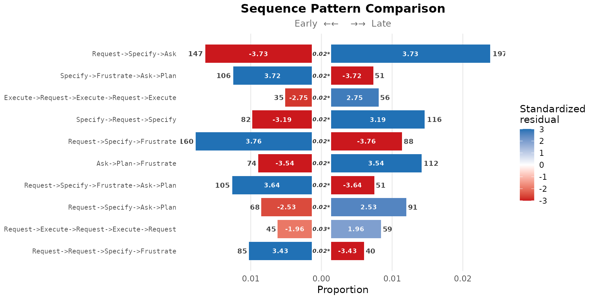
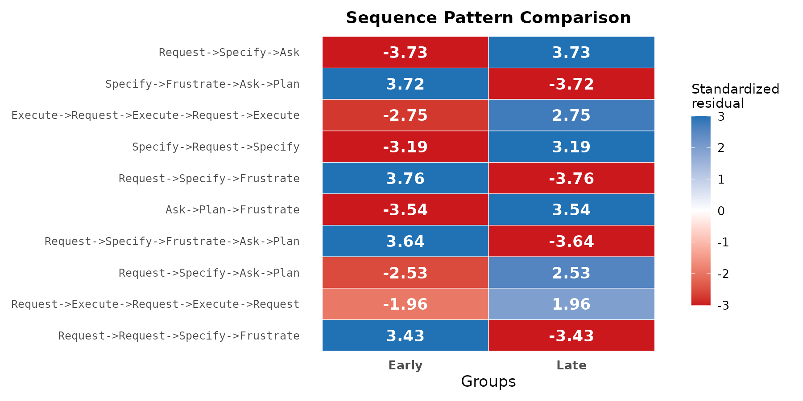
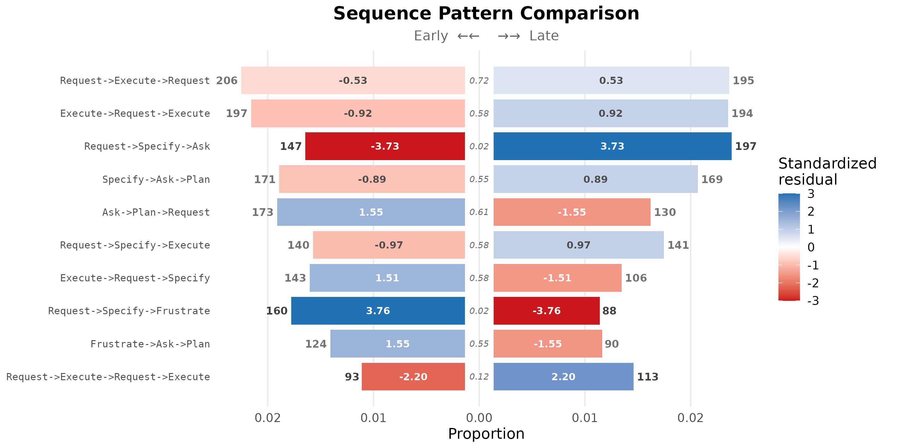
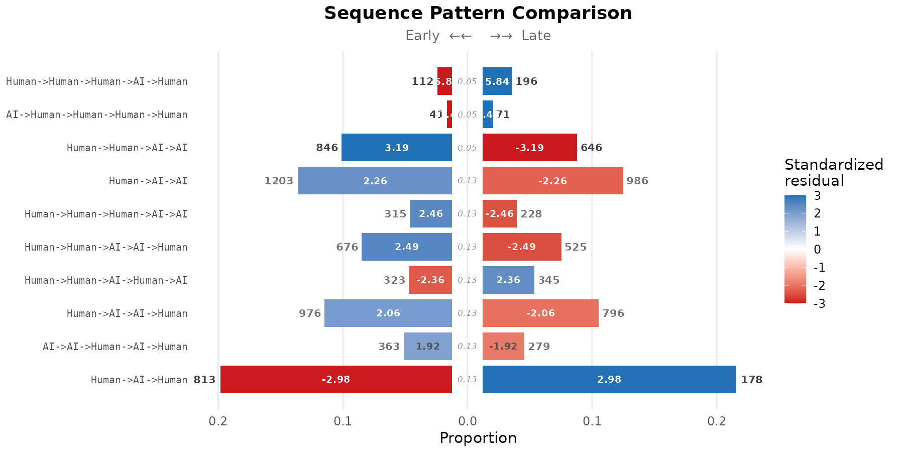

# Sequence pattern comparison: early vs late Human-AI interactions

A transition network represents the joint distribution of single-step
state transitions, marginalising over higher-order structure. When the
analytic question concerns recurring multi-step patterns — fixed-length
subsequences (k-grams) such as `Command -> Specify -> Execute` —
single-step summaries are insufficient: they decompose the pattern into
independent steps and lose its identity as a unit.

[`sequence_compare_htna()`](https://sonsoles.me/htna/reference/sequence_compare_htna.md)
operates at the k-gram level. For two or more cohorts of sessions, the
function enumerates every k-gram of length within a specified range
(e.g. `Request -> Specify -> Execute`), computes the per-cohort
frequency, and tests whether the pattern’s rate differs across cohorts
under either a chi-square or a permutation null model. Standardised
residuals identify which cohort each pattern characterises.

The example below applies the procedure to a between-session split:
sessions are ranked chronologically by their first `session_date` (ties
broken on `session_id`), the first half of sessions are labelled
`"Early"`, and the rest `"Late"`. The analytic question is which
patterns characterise the early phase of the corpus’s lifetime and which
characterise the late phase.

## Data preparation

The bundled `human_ai` corpus already carries an `actor_type` column
distinguishing Human and AI events (see
[`?human_ai`](https://sonsoles.me/htna/reference/human_ai.md)). The
session-level `phase` column marks each session as `"Early"` or `"Late"`
based on its rank in chronological order.

``` r

library(htna)
data(human_ai)

table(human_ai$phase)
#> 
#> Early  Late 
#> 10170  9177
```

## Constructing the grouped htna network

[`build_htna()`](https://sonsoles.me/htna/reference/build_htna.md)
accepts both `actor_type` (the within-session actor partition) and
`group` (the between-session cohort grouping) simultaneously. The result
is an object of class `htna_group`: a named list of htna networks, one
per cohort, each carrying the actor partition. Cohort labels are read by
[`sequence_compare_htna()`](https://sonsoles.me/htna/reference/sequence_compare_htna.md)
from the list names; no separate `group` argument is required at the
comparison step.

``` r

net_g <- build_htna(
  human_ai,
  actor_type = "actor_type",
  group      = "phase"
)
class(net_g)
#> [1] "htna_group"      "netobject_group" "list"
names(net_g)
#> [1] "Late"  "Early"
```

## Pattern comparison

[`sequence_compare_htna()`](https://sonsoles.me/htna/reference/sequence_compare_htna.md)
is invoked on the grouped network. Pattern lengths 3 to 5 are scanned;
only patterns occurring at least 25 times across the corpus are
retained. The permutation test is used because each session belongs to
exactly one cohort, so the exchangeability assumption that underlies the
permutation null is satisfied. False-discovery-rate correction
(`adjust = "fdr"`) controls for multiple testing across the candidate
patterns.

``` r

res <- sequence_compare_htna(
  net_g,
  sub      = 3:5,
  min_freq = 25L,
  test     = "permutation",
  adjust   = "fdr"
)
res
#> Sequence Comparison  [106 patterns | 2 groups: Early, Late]
#>   Lengths: 3, 4, 5  |  min_freq: 25  |  permutation: 1000 iter (fdr)
#> 
#>                                      pattern length freq_Early freq_Late
#>                        Request->Specify->Ask      3        147       197
#>  Execute->Request->Execute->Request->Execute      5         35        56
#>                    Specify->Request->Specify      3         82       116
#>                         Ask->Plan->Frustrate      3         74       112
#>       Request->Specify->Frustrate->Ask->Plan      5        105        51
#>                  Request->Specify->Ask->Plan      4         68        91
#>         Request->Request->Specify->Frustrate      4         85        40
#>                Specify->Frustrate->Ask->Plan      4        106        51
#>                  Request->Specify->Frustrate      3        160        88
#>                       Plan->Request->Execute      3        114        61
#>   prop_Early   prop_Late resid_Early resid_Late effect_size    p_value
#>  0.015089304 0.022519433   -3.733134   3.733134    5.422831 0.01512773
#>  0.003756574 0.006729960   -2.751564   2.751564    4.707396 0.01512773
#>  0.008417163 0.013260174   -3.194473   3.194473    4.650011 0.01512773
#>  0.007595976 0.012802926   -3.542427   3.542427    4.499102 0.01512773
#>  0.011269722 0.006129071    3.640078  -3.640078    4.425205 0.01512773
#>  0.007136111 0.010663229   -2.533619   2.533619    4.321670 0.01512773
#>  0.008920139 0.004687134    3.426113  -3.426113    3.832168 0.01512773
#>  0.011123937 0.005976096    3.721097  -3.721097    4.809739 0.01925347
#>  0.016423732 0.010059442    3.756080  -3.756080    4.582489 0.01925347
#>  0.011701909 0.006973022    3.315762  -3.315762    3.801624 0.01925347
#>   ... and 96 more patterns
```

The discriminative patterns appear at the top of the patterns table,
ranked by test statistic.

``` r

head(res$patterns, 10)
#>                                        pattern length freq_Early freq_Late
#> 1                        Request->Specify->Ask      3        147       197
#> 2  Execute->Request->Execute->Request->Execute      5         35        56
#> 3                    Specify->Request->Specify      3         82       116
#> 4                         Ask->Plan->Frustrate      3         74       112
#> 5       Request->Specify->Frustrate->Ask->Plan      5        105        51
#> 6                  Request->Specify->Ask->Plan      4         68        91
#> 7         Request->Request->Specify->Frustrate      4         85        40
#> 8                Specify->Frustrate->Ask->Plan      4        106        51
#> 9                  Request->Specify->Frustrate      3        160        88
#> 10                      Plan->Request->Execute      3        114        61
#>     prop_Early   prop_Late resid_Early resid_Late effect_size    p_value
#> 1  0.015089304 0.022519433   -3.733134   3.733134    5.422831 0.01512773
#> 2  0.003756574 0.006729960   -2.751564   2.751564    4.707396 0.01512773
#> 3  0.008417163 0.013260174   -3.194473   3.194473    4.650011 0.01512773
#> 4  0.007595976 0.012802926   -3.542427   3.542427    4.499102 0.01512773
#> 5  0.011269722 0.006129071    3.640078  -3.640078    4.425205 0.01512773
#> 6  0.007136111 0.010663229   -2.533619   2.533619    4.321670 0.01512773
#> 7  0.008920139 0.004687134    3.426113  -3.426113    3.832168 0.01512773
#> 8  0.011123937 0.005976096    3.721097  -3.721097    4.809739 0.01925347
#> 9  0.016423732 0.010059442    3.756080  -3.756080    4.582489 0.01925347
#> 10 0.011701909 0.006973022    3.315762  -3.315762    3.801624 0.01925347
```

### Interpreting the standardised residuals

For each pattern, the standardised residual is computed from a 2×2
contingency table of (this pattern present vs. all other patterns)
crossed with cohort:

``` math
\text{stdres}_{ij} = \frac{O_{ij} - E_{ij}}{\sqrt{E_{ij} \cdot
(1 - r_i / N) \cdot (1 - c_j / N)}}
```

A positive residual on the `Early` cohort indicates that the pattern is
over-represented in sessions from the first half of the corpus’s
lifetime; a positive residual on the `Late` cohort indicates
over-representation in sessions from the second half. By the
standardised-residual interpretation, $`|z| > 1.96`$ corresponds to
$`p < 0.05`$ at the cell level, and $`|z| > 3`$ provides strong evidence
of over- or under-representation.

## Pyramid display

The pyramid display arranges the top patterns as back-to-back horizontal
bars, with each cohort on one side. Bar length encodes the per-cohort
frequency; the in-bar label gives the standardised residual. The colour
scale is shared across both sides so that residuals are directly
comparable.

``` r

plot(res, style = "pyramid", show_residuals = TRUE)
```



The pyramid display requires exactly two cohorts and is the most direct
visual comparison when this condition is met.

## Heatmap display

The heatmap display generalises to any number of cohorts. Each column is
a cohort; each row is a pattern; cell colour encodes the standardised
residual under the same scale as the pyramid display.

``` r

plot(res, style = "heatmap")
```



## Sorting by frequency

By default, patterns are ranked by the test statistic — the most
discriminative patterns appear first. Ranking by total occurrence count
is alternative when the analytic interest is on the most common patterns
regardless of their cohort difference.

``` r

plot(res, style = "pyramid", sort = "frequency", show_residuals = TRUE)
```



## Meta-path comparison (actor-type level)

By default,
[`sequence_compare_htna()`](https://sonsoles.me/htna/reference/sequence_compare_htna.md)
enumerates k-grams over the concrete state codes. Setting
`level = "type"` first folds each state into its actor type before
pattern enumeration, so the comparison runs on meta-paths such as
`Human -> AI -> Human` rather than concrete state sequences. This
collapses the alphabet to the actor partition and surfaces which cohort
is characterised by particular handover structures between actor types,
independent of the specific codes involved.

`level = "type"` requires `x` to be an htna network carrying an actor
partition (`$node_groups`) — `net_g` above qualifies because
[`build_htna()`](https://sonsoles.me/htna/reference/build_htna.md) was
given `actor_type = "actor_type"`.

``` r

res_type <- sequence_compare_htna(
  net_g,
  level    = "type",
  sub      = 3:5,
  min_freq = 25L,
  test     = "permutation",
  adjust   = "fdr"
)
res_type
#> Sequence Comparison  [52 patterns | 2 groups: Early, Late]
#>   Lengths: 3, 4, 5  |  min_freq: 25  |  permutation: 1000 iter (fdr)
#> 
#>                         pattern length freq_Early freq_Late  prop_Early
#>  Human->Human->Human->AI->Human      5        112       196 0.012021037
#>  AI->Human->Human->Human->Human      5         41        71 0.004400558
#>            Human->Human->AI->AI      4        846       646 0.088781614
#>                   Human->AI->AI      3       1203       986 0.123485937
#>     Human->Human->Human->AI->AI      5        315       228 0.033809166
#>     Human->Human->AI->AI->Human      5        676       525 0.072555544
#>     Human->Human->AI->Human->AI      5        323       345 0.034667812
#>            Human->AI->AI->Human      4        976       796 0.102424179
#>        AI->AI->Human->AI->Human      5        363       279 0.038961039
#>                Human->AI->Human      3       1813      1780 0.186101417
#>    prop_Late resid_Early resid_Late effect_size    p_value
#>  0.023554861   -5.837799   5.837799    7.371409 0.05194805
#>  0.008532628   -3.448798   3.448798    4.064398 0.05194805
#>  0.075697211    3.189261  -3.189261    3.651386 0.05194805
#>  0.112711477    2.264188  -2.264188    2.684103 0.12750885
#>  0.027400553    2.459688  -2.459688    2.602828 0.12750885
#>  0.063093378    2.490338  -2.490338    2.579126 0.12750885
#>  0.041461363   -2.359490   2.359490    2.466456 0.12750885
#>  0.093273963    2.064052  -2.064052    2.356914 0.12750885
#>  0.033529624    1.922749  -1.922749    2.342807 0.12750885
#>  0.203475080   -2.980988   2.980988    2.279054 0.12750885
#>   ... and 42 more patterns
```

``` r

plot(res_type, style = "pyramid", show_residuals = TRUE)
```



## Choice of test statistic

The two test choices supported by
[`sequence_compare_htna()`](https://sonsoles.me/htna/reference/sequence_compare_htna.md)
correspond to different assumptions about the source of the sessions in
each cohort.

- **Permutation** (`test = "permutation"`) shuffles cohort labels at the
  session level and assumes exchangeability across sessions. It is
  appropriate when the cohorts comprise independent groups of sessions —
  for example, sessions from different time periods, projects, or
  experimental conditions — as in the chronological split used here.
- **Chi-square** (`test = "chisq"`) tests independence between pattern
  and cohort in the pooled contingency table. It assumes the underlying
  counts come from independent observations and is fast — useful as a
  default when cohorts comprise independent sessions and per-cell
  pattern counts are large enough for the asymptotic χ² approximation to
  hold. It is *not* appropriate when the same units contribute to
  multiple cohorts.

Selection of the test should follow from the design that produced the
cohort labels.
