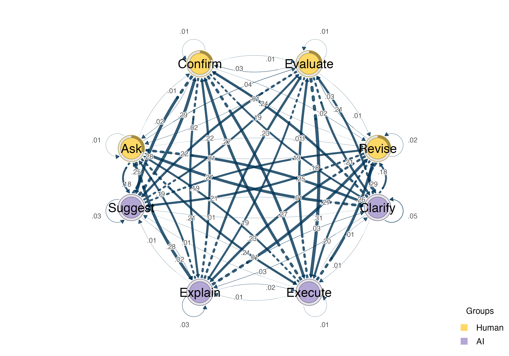
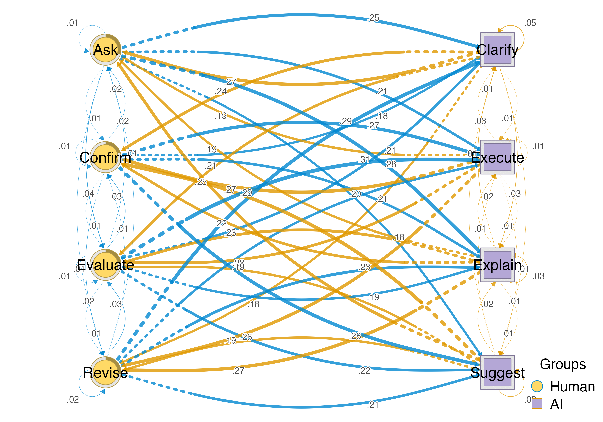

# Data Preparation for HTNA

This vignette shows how to go from raw event logs to a heterogeneous
transition network using
[`Nestimate::prepare()`](https://rdrr.io/pkg/Nestimate/man/prepare.html)
for data preparation and
[`htna::build_htna()`](https://sonsoles.me/htna/reference/build_htna.md)
for network construction.

## Starting point: a raw event log

In practice, interaction data often arrives as a single table with one
row per event. Each row records which actor performed the action, what
the action was, and when it occurred.

We simulate a Human–AI tutoring interaction where each actor has four
distinct codes:

``` r

library(htna)
library(Nestimate)

set.seed(123)

human_codes <- c("Ask", "Confirm", "Revise", "Evaluate")
ai_codes    <- c("Suggest", "Explain", "Execute", "Clarify")
sessions    <- paste0("S", sprintf("%03d", 1:30))

make_events <- function(codes, sessions, parity) {
  rows <- lapply(sessions, function(sid) {
    n <- sample(15:25, 1)
    data.frame(
      session_id       = sid,
      code             = sample(codes, n, replace = TRUE),
      order_in_session = seq_len(n) * 2L - parity,
      stringsAsFactors = FALSE
    )
  })
  do.call(rbind, rows)
}

human_data <- make_events(human_codes, sessions, 1L)
ai_data    <- make_events(ai_codes, sessions, 0L)
```

We can also combine them into a single event log with an actor column,
as data often arrives in this form:

``` r

events <- rbind(
  data.frame(actor = "Human", human_data, stringsAsFactors = FALSE),
  data.frame(actor = "AI", ai_data, stringsAsFactors = FALSE)
) 
events$actor = factor(events$actor, levels = c("Human","AI"))
events <- events[order(events$session_id, events$order_in_session), ]
head(events[, c("actor", "session_id", "code", "order_in_session")])
#>     actor session_id    code order_in_session
#> 1   Human       S001 Confirm                1
#> 616    AI       S001 Explain                2
#> 2   Human       S001  Revise                3
#> 617    AI       S001 Execute                4
#> 3   Human       S001 Confirm                5
#> 618    AI       S001 Execute                6
```

## Option 1: Single data frame with an actor column

If your data is already in long format with session and order columns,
you can pass it directly to
[`build_htna()`](https://sonsoles.me/htna/reference/build_htna.md) using
the `actor_col` argument:

``` r

net <- build_htna(events, actor_col = "actor")
net
#> Transition Network (relative probabilities) [directed]
#>   Weights: [0.006, 0.308]  |  mean: 0.140
#> 
#>   Weight matrix:
#>              Ask Clarify Confirm Evaluate Execute Explain Revise Suggest
#>   Ask      0.013   0.248   0.013    0.040   0.215   0.275  0.013   0.181
#>   Clarify  0.273   0.045   0.240    0.214   0.013   0.032  0.175   0.006
#>   Confirm  0.024   0.183   0.012    0.006   0.268   0.207  0.018   0.280
#>   Evaluate 0.021   0.210   0.035    0.007   0.308   0.189  0.007   0.224
#>   Execute  0.191   0.013   0.270    0.230   0.013   0.013  0.257   0.013
#>   Explain  0.194   0.035   0.215    0.229   0.021   0.028  0.271   0.007
#>   Revise   0.014   0.295   0.007    0.027   0.199   0.226  0.021   0.212
#>   Suggest  0.250   0.014   0.293    0.186   0.014   0.021  0.193   0.029 
#> 
#>   Initial probabilities:
#>   Ask           0.300  ████████████████████████████████████████
#>   Revise        0.267  ████████████████████████████████████
#>   Evaluate      0.233  ███████████████████████████████
#>   Confirm       0.200  ███████████████████████████
#>   Clarify       0.000  
#>   Execute       0.000  
#>   Explain       0.000  
#>   Suggest       0.000
```

``` r

plot_htna(net)
```



## Option 2: Named list of data frames

When data for each actor is stored separately (or has been prepared
independently), pass them as a named list:

``` r

net2 <- build_htna(list(Human = human_data, AI = ai_data))
net2
#> Transition Network (relative probabilities) [directed]
#>   Weights: [0.006, 0.308]  |  mean: 0.140
#> 
#>   Weight matrix:
#>              Ask Clarify Confirm Evaluate Execute Explain Revise Suggest
#>   Ask      0.013   0.248   0.013    0.040   0.215   0.275  0.013   0.181
#>   Clarify  0.273   0.045   0.240    0.214   0.013   0.032  0.175   0.006
#>   Confirm  0.024   0.183   0.012    0.006   0.268   0.207  0.018   0.280
#>   Evaluate 0.021   0.210   0.035    0.007   0.308   0.189  0.007   0.224
#>   Execute  0.191   0.013   0.270    0.230   0.013   0.013  0.257   0.013
#>   Explain  0.194   0.035   0.215    0.229   0.021   0.028  0.271   0.007
#>   Revise   0.014   0.295   0.007    0.027   0.199   0.226  0.021   0.212
#>   Suggest  0.250   0.014   0.293    0.186   0.014   0.021  0.193   0.029 
#> 
#>   Initial probabilities:
#>   Ask           0.300  ████████████████████████████████████████
#>   Revise        0.267  ████████████████████████████████████
#>   Evaluate      0.233  ███████████████████████████████
#>   Confirm       0.200  ███████████████████████████
#>   Clarify       0.000  
#>   Execute       0.000  
#>   Explain       0.000  
#>   Suggest       0.000
```

## Option 3: Prepare each actor with `Nestimate::prepare()`

When your raw data needs cleaning – e.g. session detection from
timestamps, tie-breaking, or format conversion – you can use
[`Nestimate::prepare()`](https://rdrr.io/pkg/Nestimate/man/prepare.html)
on each actor’s data independently, then feed the prepared long-format
data into
[`build_htna()`](https://sonsoles.me/htna/reference/build_htna.md).

``` r

prep_human <- prepare(
  human_data,
  actor   = "session_id",
  action  = "code",
  session = "session_id",
  order   = "order_in_session"
)

prep_ai <- prepare(
  ai_data,
  actor   = "session_id",
  action  = "code",
  session = "session_id",
  order   = "order_in_session"
)
```

[`prepare()`](https://rdrr.io/pkg/Nestimate/man/prepare.html) returns a
list with several components. The `long_data` element contains the
cleaned long-format data ready for network estimation:

``` r

head(prep_human$long_data[, c("session_id", "code", "order_in_session")])
#>   session_id    code order_in_session
#> 1       S001 Confirm                1
#> 2       S001  Revise                3
#> 3       S001 Confirm                5
#> 4       S001 Confirm                7
#> 5       S001 Confirm                9
#> 6       S001  Revise               11
```

Pass the prepared long data as a named list:

``` r

net3 <- build_htna(
  list(Human = prep_human$long_data, AI = prep_ai$long_data)
)
net3
#> Transition Network (relative probabilities) [directed]
#>   Weights: [0.006, 0.308]  |  mean: 0.140
#> 
#>   Weight matrix:
#>              Ask Clarify Confirm Evaluate Execute Explain Revise Suggest
#>   Ask      0.013   0.248   0.013    0.040   0.215   0.275  0.013   0.181
#>   Clarify  0.273   0.045   0.240    0.214   0.013   0.032  0.175   0.006
#>   Confirm  0.024   0.183   0.012    0.006   0.268   0.207  0.018   0.280
#>   Evaluate 0.021   0.210   0.035    0.007   0.308   0.189  0.007   0.224
#>   Execute  0.191   0.013   0.270    0.230   0.013   0.013  0.257   0.013
#>   Explain  0.194   0.035   0.215    0.229   0.021   0.028  0.271   0.007
#>   Revise   0.014   0.295   0.007    0.027   0.199   0.226  0.021   0.212
#>   Suggest  0.250   0.014   0.293    0.186   0.014   0.021  0.193   0.029 
#> 
#>   Initial probabilities:
#>   Ask           0.300  ████████████████████████████████████████
#>   Revise        0.267  ████████████████████████████████████
#>   Evaluate      0.233  ███████████████████████████████
#>   Confirm       0.200  ███████████████████████████
#>   Clarify       0.000  
#>   Execute       0.000  
#>   Explain       0.000  
#>   Suggest       0.000
```

``` r

plot_htna(net3, layout = "auto")
```



## When to use each approach

| Approach | Best for |
|----|----|
| Single data frame + `actor_col` | Data already clean, sessions and order defined |
| Named list of data frames | Separate files per actor, no cleaning needed |
| Separate [`prepare()`](https://rdrr.io/pkg/Nestimate/man/prepare.html) per actor | Raw timestamps, automatic session splitting, different cleaning per actor |

All three approaches produce the same network when the underlying data
is equivalent. Choose whichever fits your data pipeline.

## Handling overlapping codes

If different actors share the same code labels (e.g. both Human and AI
have a code called “Ask”),
[`build_htna()`](https://sonsoles.me/htna/reference/build_htna.md) will
raise an error by default. Set `disambiguate = TRUE` to automatically
prefix codes with the actor name:

``` r

net <- build_htna(data, actor_col = "actor", disambiguate = TRUE)
# Codes become "Human:Ask", "AI:Ask", etc.
```
