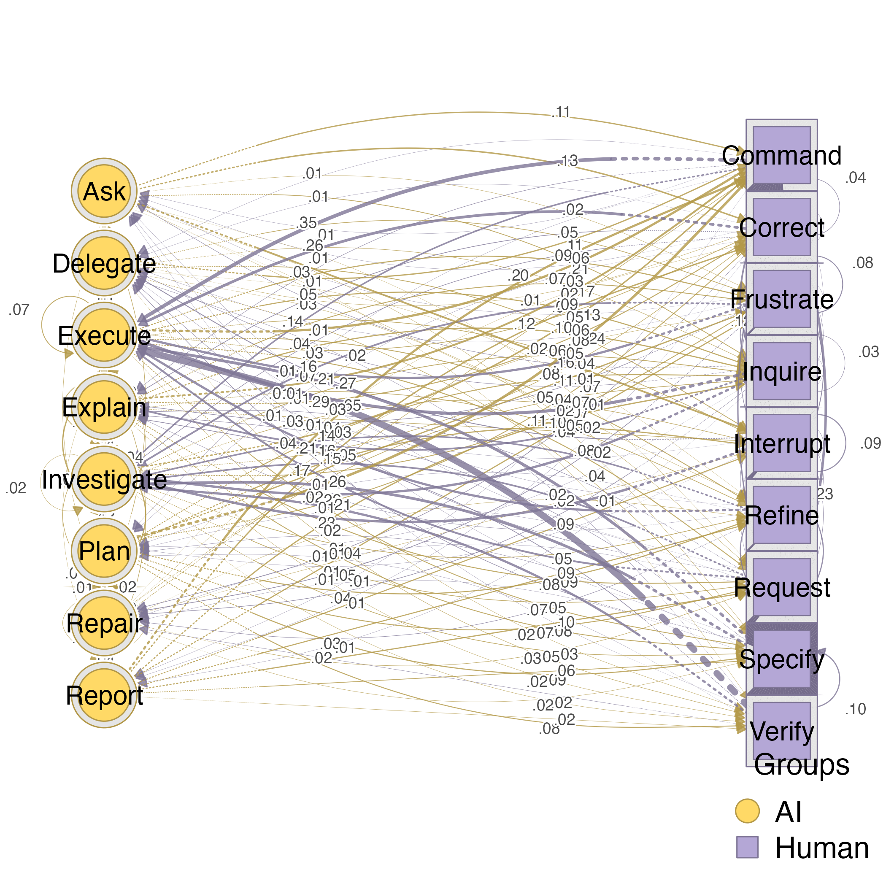
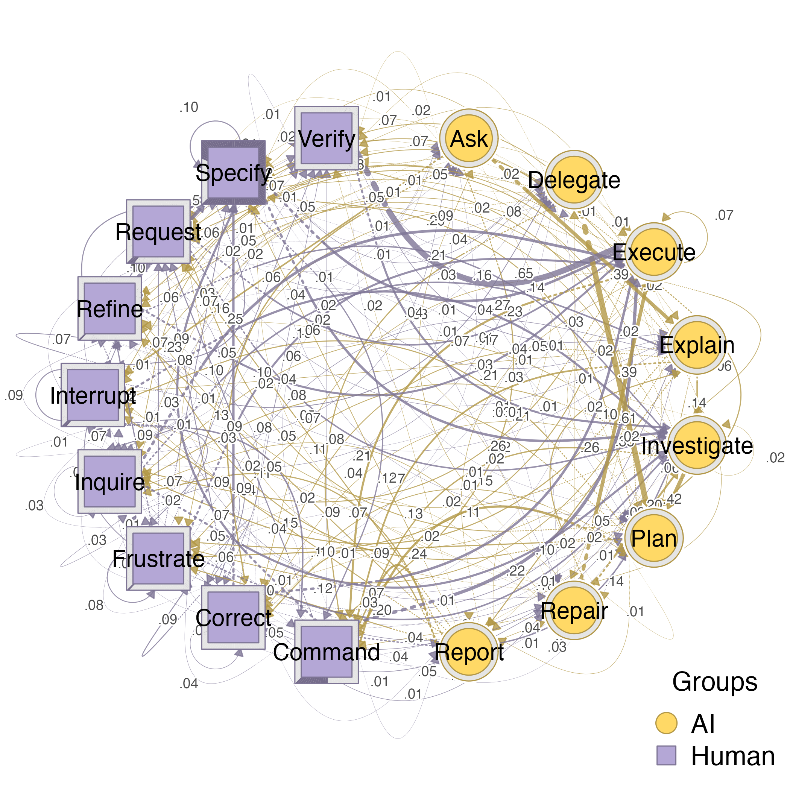
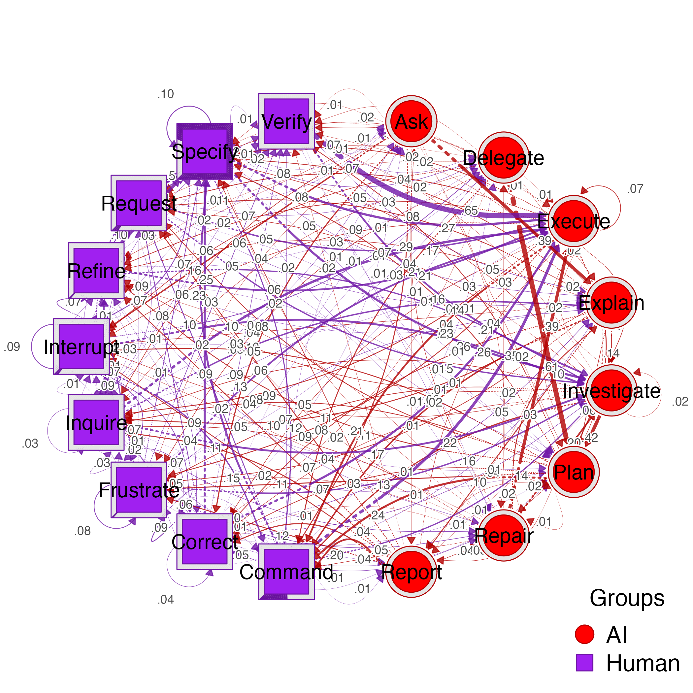
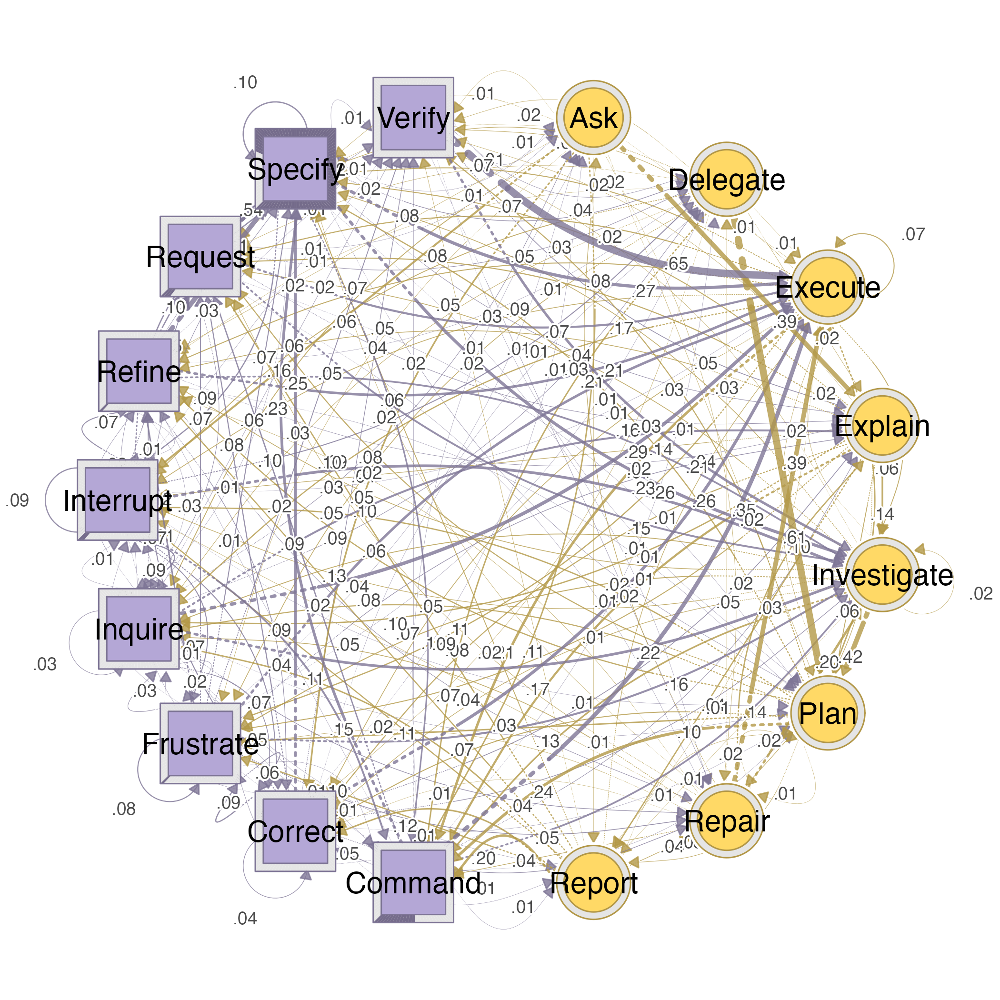
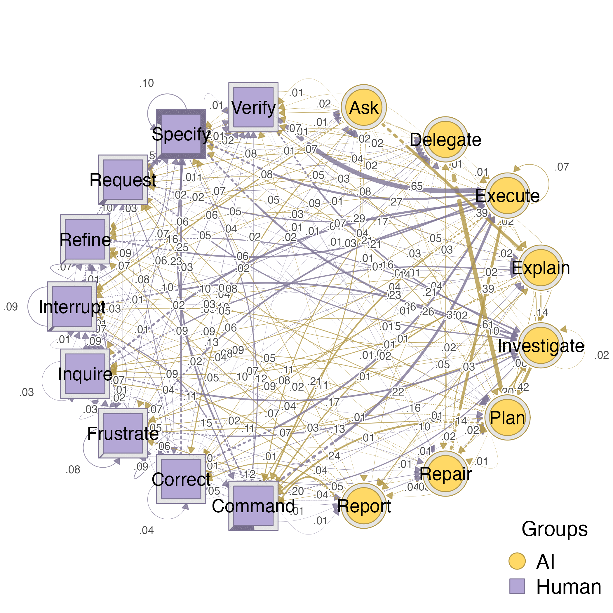
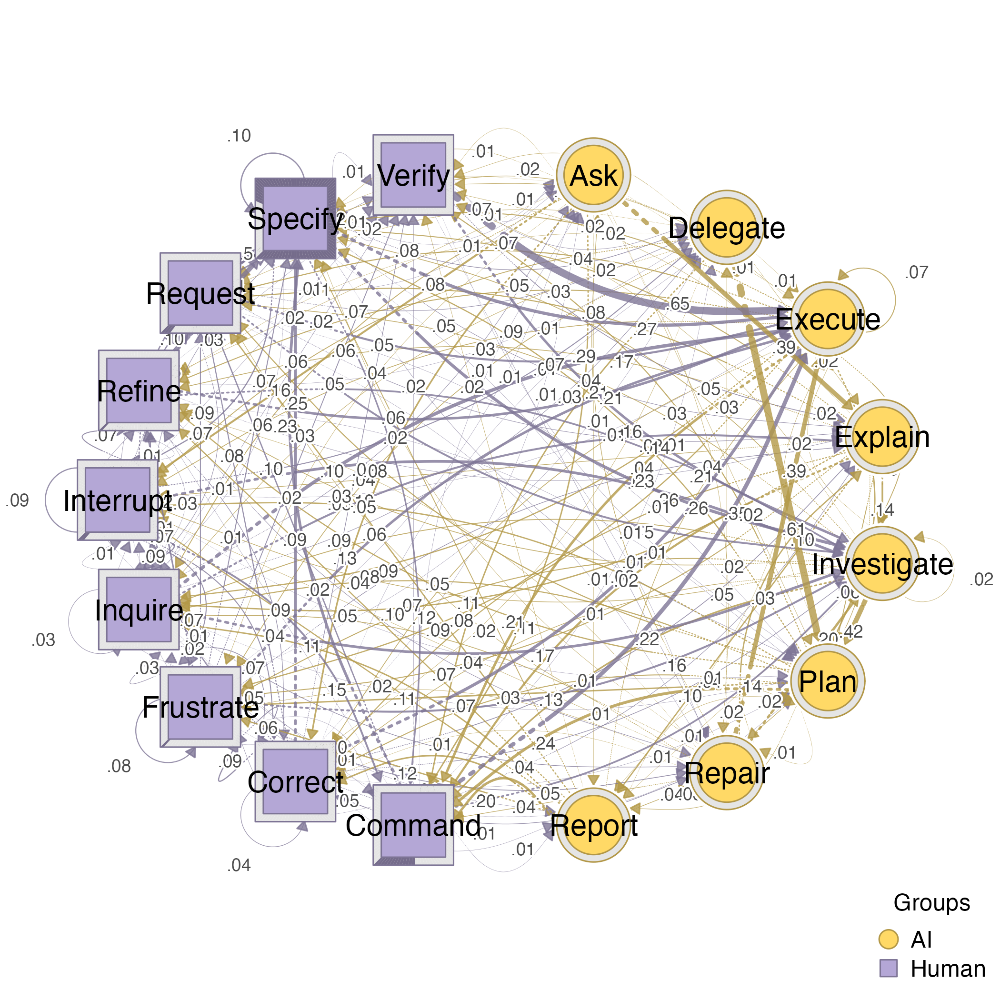
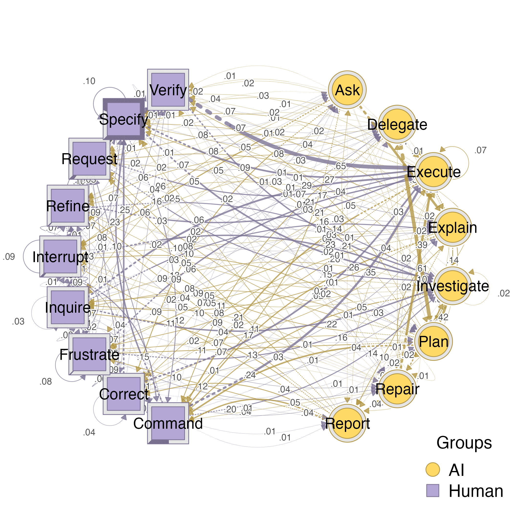
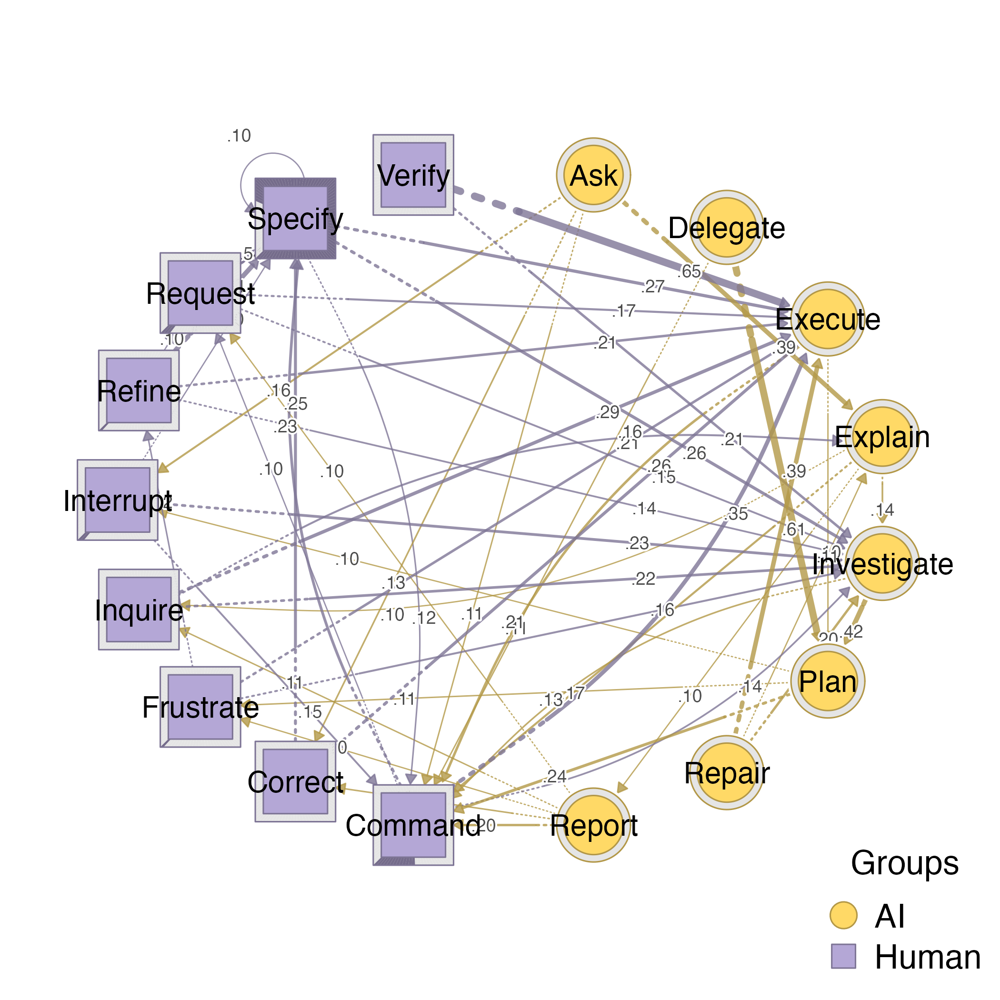
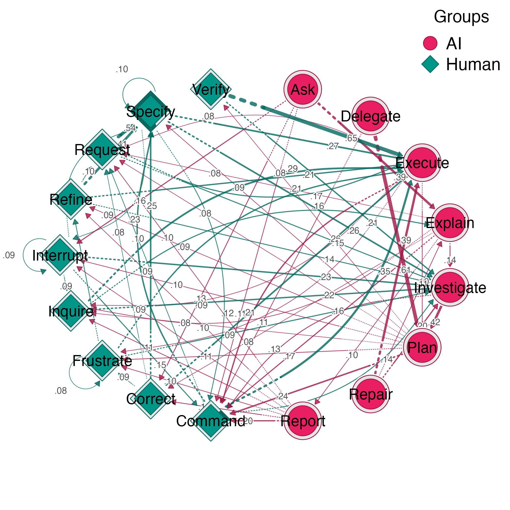

# plot_htna: 2-Group Parameter Gallery

This vignette demonstrates every
[`plot_htna()`](https://sonsoles.me/htna/reference/plot_htna.md)
parameter for 2-group (bipartite) layouts, so you can see at a glance
what each option does.

## Setup

Start by loading the package and the example data shipped with
Nestimate:

``` r

library(htna)
data(human_long, ai_long, package = "Nestimate")
```

Build the heterogeneous transition network:

``` r

m <- build_htna(list(Human = human_long, AI = ai_long))
#> Metadata aggregated per session: ties resolved by first occurrence in 'session_date' (1 sessions), 'cluster' (42 sessions)
m
#> Transition Network (relative probabilities) [directed]
#>   Weights: [0.001, 0.646]  |  mean: 0.070
#> 
#>   Weight matrix:
#>                 Ask Command Correct Delegate Execute Explain Frustrate Inquire
#>   Ask         0.000   0.108   0.129    0.000   0.011   0.387     0.022   0.065
#>   Command     0.006   0.003   0.054    0.014   0.353   0.030     0.016   0.000
#>   Correct     0.011   0.000   0.038    0.011   0.264   0.050     0.088   0.005
#>   Delegate    0.000   0.106   0.018    0.000   0.011   0.018     0.053   0.032
#>   Execute     0.000   0.209   0.053    0.000   0.074   0.003     0.088   0.088
#>   Explain     0.000   0.166   0.080    0.000   0.000   0.000     0.066   0.099
#>   Frustrate   0.005   0.009   0.064    0.012   0.208   0.035     0.078   0.033
#>   Inquire     0.029   0.011   0.054    0.027   0.285   0.163     0.025   0.033
#>   Interrupt   0.000   0.151   0.067    0.074   0.007   0.000     0.066   0.094
#>   Investigate 0.000   0.126   0.043    0.000   0.023   0.003     0.069   0.063
#>   Plan        0.000   0.242   0.070    0.000   0.015   0.000     0.112   0.083
#>   Refine      0.001   0.003   0.038    0.006   0.206   0.023     0.000   0.014
#>   Repair      0.043   0.040   0.012    0.028   0.391   0.103     0.020   0.047
#>   Report      0.000   0.205   0.123    0.000   0.035   0.000     0.099   0.111
#>   Request     0.010   0.005   0.001    0.028   0.173   0.026     0.000   0.029
#>   Specify     0.007   0.124   0.005    0.040   0.273   0.033     0.004   0.011
#>   Verify      0.010   0.004   0.002    0.022   0.646   0.052     0.000   0.004
#>               Interrupt Investigate  Plan Refine Repair Report Request Specify
#>   Ask             0.161       0.000 0.022  0.022  0.022  0.011   0.011   0.022
#>   Command         0.007       0.138 0.008  0.014  0.004  0.008   0.096   0.229
#>   Correct         0.005       0.039 0.006  0.068  0.039  0.006   0.076   0.251
#>   Delegate        0.057       0.000 0.611  0.014  0.000  0.000   0.025   0.035
#>   Execute         0.055       0.061 0.107  0.069  0.002  0.007   0.083   0.065
#>   Explain         0.037       0.136 0.058  0.047  0.039  0.103   0.076   0.068
#>   Frustrate       0.006       0.162 0.002  0.122  0.052  0.003   0.069   0.075
#>   Inquire         0.014       0.222 0.009  0.016  0.042  0.007   0.018   0.029
#>   Interrupt       0.086       0.227 0.005  0.067  0.000  0.000   0.055   0.098
#>   Investigate     0.044       0.019 0.425  0.053  0.003  0.010   0.049   0.053
#>   Plan            0.103       0.000 0.003  0.086  0.005  0.026   0.083   0.095
#>   Refine          0.008       0.141 0.013  0.000  0.025  0.000   0.102   0.413
#>   Repair          0.024       0.198 0.016  0.024  0.004  0.000   0.032   0.020
#>   Report          0.088       0.000 0.023  0.094  0.041  0.000   0.099   0.058
#>   Request         0.003       0.146 0.007  0.001  0.012  0.000   0.000   0.545
#>   Specify         0.092       0.262 0.015  0.002  0.013  0.004   0.002   0.101
#>   Verify          0.002       0.214 0.012  0.000  0.024  0.000   0.002   0.006
#>               Verify
#>   Ask          0.011
#>   Command      0.021
#>   Correct      0.043
#>   Delegate     0.021
#>   Execute      0.034
#>   Explain      0.023
#>   Frustrate    0.065
#>   Inquire      0.015
#>   Interrupt    0.005
#>   Investigate  0.017
#>   Plan         0.076
#>   Refine       0.008
#>   Repair       0.000
#>   Report       0.023
#>   Request      0.016
#>   Specify      0.012
#>   Verify       0.000 
#> 
#>   Initial probabilities:
#>   Specify       0.818  ████████████████████████████████████████
#>   Command       0.128  ██████
#>   Request       0.028  █
#>   Interrupt     0.021  █
#>   Frustrate     0.002  
#>   Refine        0.002  
#>   Ask           0.000  
#>   Correct       0.000  
#>   Delegate      0.000  
#>   Execute       0.000  
#>   Explain       0.000  
#>   Inquire       0.000  
#>   Investigate   0.000  
#>   Plan          0.000  
#>   Repair        0.000  
#>   Report        0.000  
#>   Verify        0.000
```

## 1. Defaults

Calling [`plot_htna()`](https://sonsoles.me/htna/reference/plot_htna.md)
with no extra arguments uses the htna defaults: circular layout, 0.05
edge threshold, and the built-in colour palette.

``` r

plot_htna(m)
#> Registered S3 methods overwritten by 'cograph':
#>   method             from     
#>   plot.net_stability Nestimate
#>   print.mcml         Nestimate
#> Using 'groups' column for node groups
```


## 2. Layout

The `layout` parameter controls how the two groups are arranged in
space.

### Bipartite (default for 2 groups)

Places each group in a vertical column, with cross-group edges drawn
between them. This is the classic bipartite layout.

``` r

plot_htna(m, layout = "bipartite")
#> Using 'groups' column for node groups
```



### Circular

Distributes all nodes along the perimeter of a circle, alternating
between groups. Good for emphasising the overall connectivity pattern.

``` r

plot_htna(m, layout = "circular")
#> Using 'groups' column for node groups
```


## 3. Orientation

The `orientation` parameter rotates or rearranges the bipartite layout.
It only applies when `layout = "bipartite"` (or `"auto"` with 2 groups).

### Vertical (default)

Groups are placed in two vertical columns, side by side.

``` r

plot_htna(m, orientation = "vertical")
#> Using 'groups' column for node groups
```


### Horizontal

Groups are stacked as two horizontal rows, one above the other.

``` r

plot_htna(m, orientation = "horizontal")
#> Using 'groups' column for node groups
```


### Facing

Similar to vertical, but the two columns face each other with nodes
aligned by rank, making it easier to trace individual edges.

``` r

plot_htna(m, orientation = "facing")
#> Using 'groups' column for node groups
```


### Circular orientation

Arranges each group along a semicircle, so both groups together form a
full circle.

``` r

plot_htna(m, orientation = "circular")
#> Using 'groups' column for node groups
```


## 4. Group spacing

The `group_spacing` parameter controls the horizontal distance between
the two columns. Larger values push the groups further apart, which can
help reduce edge overlap in dense networks.

``` r

plot_htna(m, group_spacing = 1)
#> Using 'groups' column for node groups
```


``` r

plot_htna(m, group_spacing = 12)
#> Using 'groups' column for node groups
```


## 5. Node spacing

The `node_spacing` parameter controls the vertical gap between nodes
within a group. Increase it when node labels overlap; decrease it for a
more compact plot.

``` r

plot_htna(m, node_spacing = 0.3)
#> Using 'groups' column for node groups
```


``` r

plot_htna(m, node_spacing = 1.5)
#> Using 'groups' column for node groups
```


## 6. Columns

The `columns` parameter splits each group into multiple sub-columns.
This is useful when a group has many nodes and a single column would be
too tall. A scalar applies to both groups; a length-2 vector sets each
group independently.

``` r

plot_htna(m, columns = 2)
#> Using 'groups' column for node groups
```


``` r

plot_htna(m, columns = c(1, 2))
#> Using 'groups' column for node groups
```


### Column spacing

When using multiple columns, `column_spacing` adjusts the horizontal gap
between sub-columns within a group.

``` r

plot_htna(m, columns = 2, column_spacing = 0.5)
#> Using 'groups' column for node groups
```


## 7. Node ordering

By default (`use_list_order = TRUE`), nodes appear in the order they are
found in the data. Setting it to `FALSE` reorders nodes by edge weight,
placing the most connected nodes at the centre of each group.

``` r

plot_htna(m, use_list_order = FALSE)
#> Using 'groups' column for node groups
```


## 8. Curvature

The `curvature` parameter controls how much cross-group edges bend. `0`
produces straight lines, while higher values increase the arc. Useful
for reducing overlapping edges.

``` r

plot_htna(m, curvature = 0)
#> Using 'groups' column for node groups
```


``` r

plot_htna(m, curvature = 1)
#> Using 'groups' column for node groups
```



## 9. Intra-group edge curvature

The `intra_curvature` parameter adds extra curvature to edges between
nodes in the same group, arcing them away from the opposite group. This
visually separates within-group from between-group transitions.

``` r

plot_htna(m, intra_curvature = 0.5)
#> Using 'groups' column for node groups
```


## 10. Group colors

### Using `group_colors` (recommended)

A vector of colours, one per group. This is the recommended approach
because it scales to any number of groups.

``` r

plot_htna(m, group_colors = c("red", "purple"))
#> Using 'groups' column for node groups
```



### Using legacy `group1_color` / `group2_color`

These parameters still work for two-group networks but do not generalise
to three or more groups.

``` r

plot_htna(m, group1_color = "green", group2_color = "darkred")
#> Using 'groups' column for node groups
```


## 11. Edge colors

By default, edge colours are derived (darkened) from the group colours
of the source node.

### Custom edge colors

Supply a vector of colours to override the automatic derivation.

``` r

plot_htna(m, edge_colors = c("red", "blue"))
#> Using 'groups' column for node groups
```


### Disable group-based edge coloring

Set `edge_colors = FALSE` to use a single default colour for all edges.

``` r

plot_htna(m, edge_colors = FALSE)
#> Using 'groups' column for node groups
```


## 12. Group shapes

The `group_shapes` parameter assigns a different node shape to each
group, adding a second visual channel beyond colour. Common shapes
include `"circle"`, `"square"`, `"diamond"`, and `"triangle"`.

``` r

plot_htna(m, group_shapes = c("diamond", "triangle"))
#> Using 'groups' column for node groups
```


### Legacy `group1_shape` / `group2_shape`

``` r

plot_htna(m, group1_shape = "triangle", group2_shape = "diamond")
#> Using 'groups' column for node groups
```


## 13. Jitter

Jitter shifts nodes horizontally based on their connectivity, breaking
the rigid column alignment. Nodes with stronger cross-group edges move
closer to the other group, giving a visual indication of coupling
strength.

``` r

plot_htna(m, jitter = TRUE)
#> Using 'groups' column for node groups
```


### Control jitter amount

A numeric value controls the maximum displacement.

``` r

plot_htna(m, jitter = 0.5)
#> Using 'groups' column for node groups
```


### Jitter both sides

By default, only the first group is jittered. Set `jitter_side = "both"`
to apply jitter to both groups.

``` r

plot_htna(m, jitter = TRUE, jitter_side = "both")
#> Using 'groups' column for node groups
```


### Jitter second group only

``` r

plot_htna(m, jitter = TRUE, jitter_side = "second")
#> Using 'groups' column for node groups
```


## 14. Legend

### No legend

``` r

plot_htna(m, legend = FALSE)
#> Using 'groups' column for node groups
```



### Legend position

The `legend_position` parameter accepts standard R positions:
`"bottomright"` (default), `"bottomleft"`, `"topleft"`, `"topright"`.

``` r

plot_htna(m, legend_position = "topleft")
#> Using 'groups' column for node groups
```


``` r

plot_htna(m, legend_position = "topright")
#> Using 'groups' column for node groups
```


## 15. Extend lines

Draw extension lines outward from each node, which can help connect
labels to nodes in dense plots. `TRUE` uses a default length; a numeric
value sets the length explicitly.

``` r

plot_htna(m, extend_lines = TRUE)
#> Using 'groups' column for node groups
```


``` r

plot_htna(m, extend_lines = 0.3)
#> Using 'groups' column for node groups
```



## 16. Layout margin

The `layout_margin` parameter adds padding around the plot area.
Increase it when labels are clipped at the edges.

``` r

plot_htna(m, layout_margin = 0)
#> Using 'groups' column for node groups
```


``` r

plot_htna(m, layout_margin = 0.4)
#> Using 'groups' column for node groups
```


## 17. Scale

The `scale` parameter adjusts all spacing proportionally, useful when
exporting at higher resolutions. A value of 2 doubles all distances.

``` r

plot_htna(m, scale = 2)
#> Using 'groups' column for node groups
```



## 18. Label abbreviation

The `label_abbrev` parameter truncates node labels to a fixed number of
characters (numeric) or lets the function choose automatically
(`"auto"`). Helpful when code names are long.

``` r

plot_htna(m, label_abbrev = 3)
#> Using 'groups' column for node groups
```


``` r

plot_htna(m, label_abbrev = "auto")
#> Using 'groups' column for node groups
```


## 19. Custom node metadata

Pass a data frame with a `label` column (for matching) and a `labels`
column (for display) to rename nodes in the plot without modifying the
network.

``` r

nodes_df <- data.frame(
  label  = c("left", "right"),
  labels = paste0("N", 1:10)
)
plot_htna(m, nodes = nodes_df)
#> Using 'groups' column for node groups
```


## 20. Angle spacing (circular/polygon layouts)

The `angle_spacing` parameter controls the empty space at corners in
circular and polygon layouts. Higher values create larger gaps at the
vertices, visually separating the groups.

``` r

plot_htna(m, layout = "circular", angle_spacing = 0.3)
#> Using 'groups' column for node groups
```



## 21. Passthrough arguments

Any additional arguments are forwarded to
[`cograph::splot()`](https://sonsoles.me/cograph/reference/splot.html)
via `...`. This gives access to the full set of rendering options.

### Hide weak edges

The `threshold` parameter (passed to splot) hides edges with weights
below the given value.

``` r

plot_htna(m, threshold = 0.1)
#> Using 'groups' column for node groups
```



### Hide edge labels

``` r

plot_htna(m, edge.labels = FALSE)
#> Using 'groups' column for node groups
```


## 22. Combining parameters

Parameters can be freely combined to fine-tune the visualisation:

``` r

plot_htna(m,
          group_colors = c("#E91E63", "#009688"),
          group_shapes = c("circle", "diamond"),
          group_spacing = 6,
          jitter = TRUE,
          jitter_side = "both",
          curvature = 0.6,
          threshold = 0.08,
          legend_position = "topright")
#> Using 'groups' column for node groups
```


